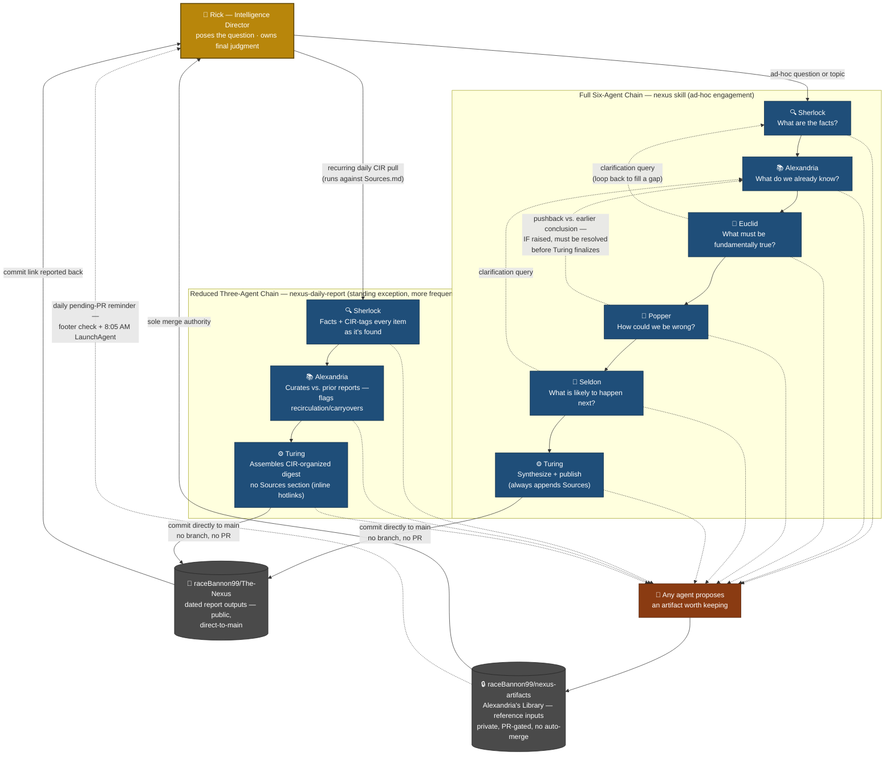

# The Nexus Intelligence Harness — Current-State Architecture

*Produced by The Nexus (full six-agent chain — Sherlock → Alexandria → Euclid → Popper → Seldon → Turing) in response to Rick's request: "Draw a diagram that illustrates the current state of the Nexus intelligence harness. Show each agent, label what they do, and demonstrate how they talk to each other."*

---

## Sherlock — What are the facts?

The harness, as currently documented across [[Nexus Workflow]], [[Nexus Project Concept]], the six [[Agent Sherlock Concept|agent concept]] notes, [[Nexus Artifact Repository]], and the three shipped skills (`nexus`, `nexus-daily-report`, `nexus-artifact-submit`), is **not one pipeline — it's two**, plus a side-channel:

1. **Full six-agent chain** (`nexus` skill, ad-hoc questions/topics): Sherlock → Alexandria → Euclid → Popper → Seldon → Turing, linear by default, with two loop-back mechanisms — cross-agent clarification (any agent may query an *earlier* one mid-stage) and mandatory pushback resolution (any pushback Popper raises against an earlier agent must be explicitly revised-or-stood-by before Turing finalizes). Turing always appends a `## Sources` section and publishes straight to `main` on `raceBannon99/The-Nexus`.
2. **Reduced three-agent chain** (`nexus-daily-report` skill, standing exception since 2026-07-16): Sherlock → Alexandria → Turing only. No Euclid, Popper, or Seldon. Sherlock's job is expanded to include CIR-tagging as it gathers; no pushback loop exists because there's no Popper to raise one; no end-of-report Sources section (every item already carries an inline hotlink). This is the more frequently-run path — it fires on every recurring daily pull, versus the full chain which fires per ad-hoc question.
3. **Artifact side-channel**, orthogonal to both chains above: *any* agent in either chain may propose something worth permanently archiving. That always goes into a **second, separate repo** (`raceBannon99/nexus-artifacts`, private) via Pull Request — never a direct commit — and Rick is the sole merge authority. This is the opposite git policy from the reports repo, and the two must never be conflated.

Rick sits at both ends: he originates every engagement (poses the question, or the daily pull runs on his schedule) and receives every output (a commit link for reports; PR review authority for artifacts; a daily reminder — a footer check on every Nexus run, plus an 8:05 AM local LaunchAgent notification — for anything left pending in the artifact queue).

## Alexandria — What do we already know?

No precedent exists for this specific request. A search of `raceBannon99/The-Nexus/reports` turned up ten prior reports — CIR daily digests and several ad-hoc engagements (CMMC, Harmony Bridge, Vanguard estimate, crypto-loss paradox) — but nothing that previously diagrammed the harness itself. This is the first self-referential engagement of its kind.

## Euclid — What must be fundamentally true?

Stripped to first principles, three things are true regardless of how the diagram is drawn:

- **There is one reasoning process, not six independent programs.** "Agents" are role-framings applied sequentially within a single working context, not persistent services with separate memory or infrastructure. A diagram that implies six concurrently-running processes would misrepresent the mechanism.
- **The topology is fundamentally a directed handoff, not a mesh.** Each stage passes its answer plus supporting evidence to the next stage in sequence. The two loop-back mechanisms (clarification, pushback resolution) are the *only* backward edges that exist by design — everything else is one-directional.
- **Rick is a node in the graph, not an external observer of it.** He originates every engagement and is the sole approval gate for one of the two output repos. A diagram of "how the agents talk to each other" that omits him would describe a system Rick doesn't actually run — the whole design premise is that Nexus amplifies his judgment, not replaces it.

## Popper — How could this diagram be wrong or misleading?

Four specific risks, raised against the draft before publishing:

1. **Implying all six agents run on every engagement.** False, and it's the more common failure mode given the daily report runs more frequently than ad-hoc questions. *Resolution: the diagram shows both chains explicitly, as separate subgraphs, not one merged "the" pipeline.*
2. **Implying the pushback loop fires every run.** It only fires when Popper actually finds something to challenge — it's a conditional mechanism, not a guaranteed loop. *Resolution: drawn as a dashed/conditional edge, labeled as conditional, not a solid always-executes arrow.*
3. **Implying persistent, independently-running agent processes.** Addressed under Euclid above. *Resolution: added an explicit caveat in the "How to read this" section below, rather than relying on the diagram alone to convey it.*
4. **Conflating the two output repos.** They have opposite git policies (direct-to-main vs. PR-gated-private) — visually merging them into one "output" box would erase a distinction the source docs treat as critical. *Resolution: drawn as two separate cylinder nodes with their policies labeled inline.*

All four are resolved in the diagram/legend below, not left as open criticism.

## Seldon — What is likely to happen next?

- **Moderate-high confidence (~70%):** the reduced-chain pattern generalizes. The daily report already went from full-six to reduced-three once the process proved stable; it's plausible other recurring (non-one-off) engagement types get their own trimmed pipelines as trust builds, mirroring that precedent.
- **Moderate-high confidence (~75%):** the cross-agent clarification and pushback-resolution mechanisms persist rather than get simplified away — they're the structural source of the "more rigorous than a single AI" claim in [[Nexus Project Concept]], and removing them would undercut the stated value proposition.
- **Lower confidence (~20%):** the artifact repo's PR gate loosens to direct-commit. [[Nexus Artifact Repository]] explicitly frames the friction as intentional ("nothing enters the permanent archive without a human decision"); the reports repo only moved to direct-to-main after Rick explicitly confirmed the process was stable across several runs — no equivalent confirmation exists yet for the artifact repo, and its stated purpose (irreversible, sometimes third-party-authored archival) argues against ever removing the human gate.
- **Signal to watch:** if a third recurring engagement type gets proposed, whether it launches with a full or reduced chain from day one will indicate whether "start full, reduce once proven" is becoming the standing default or was specific to the daily report.

---

## Turing — The Diagram

### Legend

| Element | Meaning |
|---|---|
| Solid arrow | Default handoff — output plus evidence passed forward |
| Dashed arrow | Conditional / loop-back — clarification query, pushback, or artifact proposal; not guaranteed every run |
| Blue box | An agent (a role-framing, not a persistent process — see below) |
| Gray cylinder | A GitHub repo |
| Orange box | A Pull Request — the only way anything enters `nexus-artifacts` |
| Gold box | Rick — originates every engagement, sole merge authority on the artifact repo |

### How to read this

- **"Agents" are sequential role-framings, not six separate running programs.** One reasoning process adopts each persona in turn within a single engagement; nothing here implies standing infrastructure or concurrent execution.
- **The two subgraphs are alternatives, not stages of one pipeline.** An engagement runs one or the other — never both, never a partial six-agent run.
- **Dashed edges are conditional.** Clarification queries and pushback only occur when a stage actually needs one; most runs won't exercise every dashed edge shown.
- **The two output repos are deliberately drawn separately** because they run opposite git policies: `The-Nexus` is direct-to-main with no review gate; `nexus-artifacts` requires a PR and Rick's explicit merge, every time, no exceptions.

---

## Sources

*This report is self-referential — its subject is the Nexus system's own documentation, not external web sources. All entries below are Rick's private Obsidian vault notes, not published externally, so no URLs are given (per standing rule: never fabricate one).*

- **Nexus Workflow.md** — primary source for the full six-agent sequence, cross-agent clarification, pushback resolution, and the daily-report reduced-chain exception.
- **Nexus Project Concept.md** — origin/philosophy framing; source for the six guiding questions and Rick's role as Intelligence Director.
- **Agent Sherlock/Alexandria/Euclid/Popper/Seldon/Turing Concept.md** (six notes, `Nexus Agents/` folder) — per-agent mission statements, quoted directly in the diagram's node labels.
- **Nexus Artifact Repository.md** — source for the artifact side-channel: submission flow, PR-only policy, Rick's sole merge authority, and the daily reminder mechanism (footer check + LaunchAgent).
- **`.claude/skills/nexus/SKILL.md`, `.claude/skills/nexus-daily-report/SKILL.md`, `.claude/skills/nexus-artifact-submit/SKILL.md`** — the three shipped, invocable implementations of the above, confirmed consistent with their source-of-truth docs as of this run.
- **`gh api repos/raceBannon99/The-Nexus/contents/reports`** — confirmed no prior architecture/diagram precedent exists in the reports history (Alexandria's curation check).
