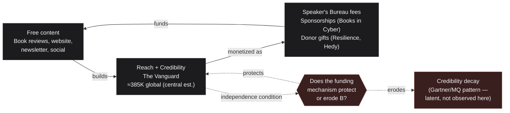

# Is The Canon Project's B2C/B2B Hybrid Business Model Sound?

**Question posed:** The Canon Project is trying to run both a B2C and a B2B business. It's B2C in terms of appealing to the Vanguard (website, social media, newsletter) and B2B in terms of revenue (Speaker's Bureau and sponsored events like Books in Cyber) and large donations (donor companies Resilience and Hedy). Is that a sound business model?

*Produced by The Nexus per the current [[Nexus Workflow]]: Alexandria → Sherlock → Euclid → Popper → Seldon → Tufte → Turing → Alexandria. This is the first full engagement run under the updated eight-step process (Tufte added, Alexandria opens and closes the chain).*

---

## Bottom Line

**Yes, structurally — but "B2C and B2B" is the wrong way to describe what's actually happening, and that mis-description is hiding the real risk.** The Canon isn't running two businesses; it's running one — a single trust-arbitrage model in which free, credible content builds reach (the Vanguard), and that earned credibility is what gets sold, in different packaging, to the B2B side (Speaker's Bureau fees, sponsorships, donations). That's a well-precedented model (TED, SANS, trade press). The soundness question isn't whether this can work — it's whether the specific mechanism funding it protects or erodes the credibility it depends on. Right now: probably protected, but under-diversified and under-tested. Two donor companies, a four-person speaker roster with the CEO as one of the four, and one unproven sponsored event is a thin base for what is, at its core, a single-point-of-failure revenue model wrapped around an asset (trust) that's slow to build and fast to lose.

---

## Alexandria — What Do We Already Know? (Opening)

Checked Alexandria's Library (`nexus-artifacts`) first: nothing on point. The three artifacts currently archived — the Evidence Tier Framework, the D&D Alignment Chart Framework, and the First Principles Infographic — don't address business models, nonprofit revenue structures, or the Canon's own operations. This is new ground for the Library.

The broader Nexus archive (`raceBannon99/The-Nexus`) is a different story — two prior reports are directly load-bearing for this question, not just background:

- **["Five Ways to Say 'Expand Our Reach'"](https://github.com/raceBannon99/The-Nexus/blob/main/reports/2026-07-15-canon-reach-strategy-phrasings.md) (2026-07-15)** coined "the Vanguard" — the term the question itself uses — grounded in Rogers' *Diffusion of Innovations* (opinion leaders / early adopters). It also established the Michelin Guide and SANS Reading Room as the working precedents for how a "first source" authority earns trust: independence and repetition, not persuasion.
- **["Sizing the Vanguard"](https://github.com/raceBannon99/The-Nexus/blob/main/reports/2026-07-17-vanguard-cybersecurity-professionals-estimate.md) (2026-07-17)** put a number on that audience: **≈275,000–650,000 globally (central ≈385,000)**, **≈65,000–160,000 in the US (central ≈95,000)** — a triangulated estimate, not a measurement, but the best available planning figure for how large the Canon's addressable B2C reach actually is.

Both are treated as established fact for this report rather than re-derived. The Evidence Tier Framework (fact-sheet, added 2026-07-19) is reused here too — every claim below is tagged Tier 1 (multi-sourced/independently verifiable), Tier 2 (single interested-party source), or Tier 3 (imported by analogy, not case-specific).

---

## Sherlock — What Are the Facts?

**The Canon's own structure, from its Speaker's Bureau page** *(Tier 1 — cybercanon.org, first-party)*: CyberCanon is a nonprofit; Rick Howard is CEO/co-founder, Helen Patton is founder. For commercial events, the Speaker's Bureau charges "a standard engagement price," which — because the Canon is a nonprofit — "is treated as a donation and may be tax-deductible." Community and nonprofit engagements get reduced or travel-only terms. The current bookable roster is four people: Helen Patton, Rick Howard, Dr. Jack Freund, and Matt Stamper — all Hall-of-Fame-adjacent authors or committee members, not a large stable of speakers. → [Speaker Bureau page](https://cybercanon.org/speaker-bureau/)

**Books in Cyber, the named sponsored event** *(Tier 1 — booksincyber.com, first-party)*: a free, half-day virtual conference — "Vol. I · 2026," meaning this is its **first-ever edition**, not an established annual fixture. Revenue comes entirely from two sponsorship tiers: "Logo Sponsor" (site/livestream/email/newsletter mention) and "Speaker Sponsor" (adds a 20-minute slot for the sponsor's own book author). CyberCanon is listed alongside a company called "EK Cyber" under "Partners." → [Books in Cyber](https://booksincyber.com/)

**The two named donor companies are not comparable in scale** *(Tier 1 for Resilience, Tier 2 for Hedy)*:
- **Resilience** (cyberresilience.com) is a well-capitalized, venture-backed cyber risk/insurance company founded in 2016, backed by General Catalyst, Founders Fund, and Lightspeed Venture Partners, targeting organizations from $25M to $10B+ in revenue. This is a substantial, durable company. → [Resilience — About](https://cyberresilience.com/about-us) / [World Economic Forum profile](https://www.weforum.org/organizations/resilience/)
- **Hedy** (almost certainly "Hedy Cyber," per Crunchbase and LinkedIn) is a much smaller, earlier-stage company building a covert, software-defined VPN/networking product. Public footprint is thin — a Crunchbase listing and a single LinkedIn engineering post are the strongest corroboration found; this is Tier 2 sourcing (single-source-leaning), not independently confirmed at the depth Resilience's profile is. → [Hedy Cyber — Crunchbase](https://www.crunchbase.com/organization/hedy-cyber)

**Reach signal, for scale comparison against the Vanguard's ≈385,000-person global estimate**: CyberCanon's LinkedIn page shows **4,400+ followers** — a real but modest audience next to the addressable Vanguard population, via general search coverage (not independently verified against LinkedIn directly this session; treat as directional, Tier 2).

**A real-world cautionary parallel exists for donor-adjacent-to-covered-industry criticism, even without misconduct being proven**: Gartner's Magic Quadrant has drawn public, named conflict-of-interest criticism — Rubrik's CEO published a 2019 blog post titled "Gartner Failed to Manage a Major Conflict of Interest and Bias at the Heart of the 2019 MQ Drafting," and NetScout separately sued Gartner in 2014 over its placement (Gartner's motion to dismiss was later granted; a court finding of "not pay-for-play" is not the same as public perception never being damaged in the meantime). This is imported by analogy — a different industry, different mechanism (paid research subscriptions vs. donations/sponsorships) — so it's Tier 3 evidence for the Canon specifically, but a legitimate structural precedent for "adjacent-industry funding invites credibility challenges regardless of actual wrongdoing." → [Rubrik, "Our Perspective on Gartner's 2019 Magic Quadrant"](https://www.rubrik.com/blog/company/19/10/perspective-gartner-2019-magic-quadrant) / [techpartner.news, NetScout v. Gartner](https://www.techpartner.news)

**Library-worthy candidate flagged**: none of the above is itself archive-worthy as a standalone artifact — these are case facts, not reusable frameworks. (Noted per the new workflow's instruction to flag candidates at each stage; carried to Alexandria's closing evaluation below.)

---

## Euclid — What Must Be Fundamentally True?

Strip the framing in the question itself. **"Running a B2C business and a B2B business" is a category error.** There are not two businesses here — there is one business with two visible faces:

1. **A cost center that produces trust.** Free content (book reviews, the website, the newsletter, social presence) reaches the Vanguard. This is not "the B2C business" generating its own revenue — it produces no direct income. Its output is an intangible asset: earned credibility with a specific, identifiable, hard-to-reach audience (the practitioners the rest of the field takes its cues from, per the Vanguard's own definition).
2. **A revenue center that monetizes that trust, not separate content.** The Speaker's Bureau, Books in Cyber sponsorships, and corporate donations aren't a second product line — they're different packaging for selling access to, or association with, the same credibility the free side built. A sponsor pays for the newsletter mention; an event organizer pays for the Hall-of-Fame-author's presence; a donor pays, in part, for association with a trusted nonprofit brand.

**What must be true for this to be sound, stated as three testable conditions — not "is it B2C or B2B," but:**

- **Scale condition**: the free side must reach enough of the Vanguard that the paid side's association value is real, not symbolic. (Partially met: 4,400+ LinkedIn followers against a ≈385,000-person global Vanguard is a small fraction of the addressable market — real, but early-stage reach, not yet a dominant position.)
- **Independence condition**: the mechanism that pays for the free side must not visibly compromise its content, or the entire asset being sold degrades. This is the same principle the prior Canon report already identified in the Michelin Guide precedent — Michelin's independence is credible specifically because its revenue (tires) has nothing to do with the restaurants it rates. The Canon's donors (Resilience, Hedy) are cybersecurity companies operating in the same industry the Canon's daily intelligence work and book-review subjects cover — a structurally closer relationship than Michelin's, and closer to the Gartner pattern than the Michelin one.
- **Diversification condition**: revenue concentrated in a small number of relationships (two donors, four speakers, one unproven event) behaves like any concentrated-revenue business — fragile to any single relationship ending, regardless of how sound the underlying model is.

**The reframe changes the actionable question.** Not "how do we balance B2C and B2B effort" (implies competing budgets, a false tradeoff) but "how do we protect the one asset (trust) that both sides of this model actually depend on, while diversifying who pays for it."

---

## Popper — How Could We Be Wrong?

Five challenges, none left unaddressed:

**1. Is the "one business, not two" reframe just a clever rewording, or does it actually change what Rick should do?** A reframe that doesn't change any decision is rhetoric, not analysis.

**2. The independence/credibility-erosion risk is asserted, not demonstrated.** No evidence was found — in this session's research — that any Canon book review, Hall of Fame designation, or recommendation has actually been influenced by Resilience's or Hedy's donations. Treating a theoretical risk as though it were an observed problem overstates the case.

**3. Donor concentration is called a risk with no actual numbers behind it.** Two donors "sounds" concentrated, but without knowing what share of the Canon's budget they represent, this is an assumption, not a finding.

**4. Rick Howard is simultaneously the CEO of the nonprofit being assessed here, one of only four bookable Speaker's Bureau names generating its B2B revenue, *and* the Intelligence Director who commissioned this very assessment through his own consulting practice's AI team.** That's worth naming plainly rather than stepping around it.

**5. Books in Cyber and the Speaker's Bureau roster are both thin evidence for "a B2B revenue engine."** One first-time event with two sponsors and a four-person speaker list could just as easily be an experiment that hasn't proven it scales yet, not an established revenue channel.

---

## Seldon — Resolving Popper, and What's Likely Next

Addressing each challenge before moving to forecasts — this is where Euclid's answer gets updated, not just defended:

**On #1 (does the reframe matter):** *Revised, not just stood by.* It changes the recommendation concretely: the useful next step isn't "grow B2C reach and B2B revenue in parallel" (treats them as separate workstreams competing for attention) — it's "make the independence condition explicit and visible" (e.g., a stated editorial-firewall policy between donor relationships and review/Hall-of-Fame decisions) *before* growing either side further, since growth without that firewall scales the exposure, not just the reach.

**On #2 (no demonstrated harm):** *Conceded and revised.* This report found no evidence of actual compromised output — the risk is structural and latent (Tier 3, imported from the Gartner/Rubrik pattern), not a documented failure at the Canon specifically. The language above is revised accordingly: this is a **latent structural risk**, not an observed one. That distinction matters for how urgently Rick should act on it.

**On #3 (concentration risk, no numbers):** *Stood by, with the limit stated honestly.* The Nexus has no visibility into the Canon's actual budget or the dollar share Resilience and Hedy represent — that's information only Rick has. The risk claim is downgraded from "this is a problem" to "this is a question only Rick can answer, and the answer changes how urgent diversification is."

**On #4 (Rick's dual role):** *Stood by, stated directly rather than softened.* His CEO role and speaker listing are already public on the Canon's own site — this isn't a hidden conflict, and founder-as-spokesperson is normal for this kind of nonprofit (TED's own curators speak at TED). But it's worth Rick noting explicitly: this report is First Principles Consulting's own AI team assessing the soundness of its founder's other nonprofit venture. That's not disqualifying, but a report that didn't name it would be less honest than one that does.

**On #5 (thin evidence of a working B2B engine):** *Conceded.* Agreed — Books in Cyber's first volume and a four-name speaker roster are early signal, not proof of a repeatable channel.

**Forecasts, with confidence levels:**

- **Moderate-high confidence (≈70%)**: the underlying model — free reach funding paid association — is structurally sound and matches well-precedented nonprofit/media patterns (TED, SANS). The model itself is not the risk.
- **Moderate confidence (≈55–60%)**: today's *specific execution* — two donors, four speakers, one unproven event — remains fragile over the next 12–18 months even if the long-run model is right. Sound model, under-diversified today.
- **Lower-moderate confidence (≈40–45%)**: credibility erosion becomes a *visible*, public problem (criticism, a withdrawn nomination, a donor controversy) within 2–3 years absent an explicit independence policy. Precedent (Gartner) suggests this kind of criticism surfaces eventually for donor-adjacent review bodies, but rarely causes existential damage on its own — a slow-burn risk, not a near-term one.
- **Signals worth monitoring**: whether the donor count grows past two within a year; whether the Speaker's Bureau roster grows past four; whether Books in Cyber runs a Vol. II with more sponsors (the real test of whether it's a channel, not an experiment); any public commentary questioning the Canon's independence.

---

## Tufte — Seeing the Model

The reframe is easier to see than to explain. This is one loop, not two businesses:

**Where the model is exposed today**, at a glance:

| Condition | Status | Evidence |
|---|---|---|
| Scale (reach vs. Vanguard) | Early-stage | 4.4K LinkedIn followers vs. ≈385K global Vanguard (central est.) |
| Independence (funding vs. credibility) | Untested, no explicit firewall found | Donors operate in the same industry the Canon covers — closer to the Gartner pattern than the Michelin one |
| Diversification (revenue concentration) | Thin | 2 named donors, 4-person speaker roster, 1 unproven event (Vol. I) |

---

## Turing — Anything Become a Skill?

Checked with each agent on this pass. Nothing performed here rises to a reusable, automatable skill — the research (site navigation, company lookups, precedent search) used only general-purpose tools already available, and the analytical moves (the trust-arbitrage reframe, the three-condition test) are report-specific reasoning, not a repeatable procedure. **No new skill built this round.**

---

## Alexandria — Curating the Library, and the Recommendation to Rick (Closing)

Collecting what each agent flagged along the way, one genuine candidate emerged: the **three-condition soundness test** Euclid derived — scale, independence, diversification — as a general test for *any* hybrid free-reach/paid-monetization model, not just this one. It's the same kind of reusable methodology as the existing Evidence Tier Framework artifact. Full rationale and status are in **Library Recommendations** below, not just here — this is a recommendation, not an action; the decision is Rick's.

Publishing this report now to `raceBannon99/The-Nexus`, direct to `main`.

---

## Sources

**Primary/official (Tier 1 — the Canon's own properties):**
- [CyberCanon, Speaker Bureau page](https://cybercanon.org/speaker-bureau/) — nonprofit/donation fee structure, current speaker roster, pricing philosophy.
- [CyberCanon, homepage](https://cybercanon.org/) — site navigation and structure.
- [Books in Cyber, Vol. I · 2026](https://booksincyber.com/) — sponsorship tiers, "free half-day virtual conference" framing, partner listing.

**Company profiles (donor characterization):**
- [Resilience, About Us](https://cyberresilience.com/about-us) (Tier 1) — founding year, backers, target market.
- [World Economic Forum, Resilience organization profile](https://www.weforum.org/organizations/resilience/) (Tier 1) — independent corroboration of Resilience's positioning.
- [Hedy Cyber, Crunchbase profile](https://www.crunchbase.com/organization/hedy-cyber) (Tier 2) — thinly-corroborated company description; single-source-leaning.

**Cross-incident analogy (Tier 3 — imported, not case-specific):**
- [Rubrik, "Our Perspective on Gartner's 2019 Magic Quadrant"](https://www.rubrik.com/blog/company/19/10/perspective-gartner-2019-magic-quadrant) — a named, public conflict-of-interest critique of an adjacent-industry analyst model; supports the "donor-adjacent-to-covered-industry invites credibility challenges" pattern.
- techpartner.news, "Gartner sued over vendor's poor Magic Quadrant placing" (2014) — independent press coverage of the NetScout v. Gartner suit, cross-checking the pattern isn't a single incident.
- [Wikipedia, Michelin Guide](https://en.wikipedia.org/wiki/Michelin_Guide) — via the prior Canon reach-strategy report; the contrast case for a fully independence-firewalled revenue model.

**Internal precedent (Nexus archive):**
- [The Nexus, "Five Ways to Say 'Expand Our Reach' — Cybersecurity Canon Sub-Strategy 1" (2026-07-15)](https://github.com/raceBannon99/The-Nexus/blob/main/reports/2026-07-15-canon-reach-strategy-phrasings.md) — origin of "the Vanguard," Michelin/SANS precedent.
- [The Nexus, "Sizing the Vanguard" (2026-07-17)](https://github.com/raceBannon99/The-Nexus/blob/main/reports/2026-07-17-vanguard-cybersecurity-professionals-estimate.md) — Vanguard population estimates used throughout this report.
- [nexus-artifacts, Evidence Tier Framework](https://github.com/raceBannon99/nexus-artifacts/blob/main/fact-sheets/evidence-tier-framework.md) — Tier 1/2/3 sourcing convention applied throughout this report.

---

## Library Recommendations

*(Added 2026-07-21, same-day structural fix — this recommendation existed only as prose in the Alexandria closing section above when first published; it's given its own entry here so it can be found without rereading the narrative, matching how a "New Skills" section would be structured if Turing had built one this round.)*

| Candidate | Category | Recommended by | Rationale | Status |
|---|---|---|---|---|
| B2C-Reach / B2B-Revenue Soundness Test | fact-sheet | Alexandria, synthesizing Euclid's three-condition framework (scale, independence, diversification) | Generalizes cleanly beyond the Canon — a reusable test for any hybrid free-reach/paid-monetization model, same category of tool as the existing Evidence Tier Framework artifact | **Submitted** — [PR #4](https://github.com/raceBannon99/nexus-artifacts/pull/4), awaiting Rick's merge |

**Updated 2026-07-21**: Rick approved this recommendation; [PR #4](https://github.com/raceBannon99/nexus-artifacts/pull/4) is now open against `nexus-artifacts`. Per [[Nexus Artifact Repository]]'s "Closing the Loop" section, one step remains: once Rick merges it, a further Update Pass changes this row's status to "Added to Library," linked to the artifact's final path, **and** a new entry gets added to the Sources section above citing it directly.

No other candidates were flagged this round. Sherlock, Euclid, Popper, and Seldon each considered the case-specific facts in their sections (Resilience's and Hedy's company profiles, the Books in Cyber sponsorship terms, the Gartner/Rubrik precedent) and treated them as facts about this case, not reusable frameworks. Tufte's flywheel diagram is similarly case-specific as drawn (it names the Canon, the Vanguard, and the two donors directly), so it isn't recommended for the Library either.

**General reach signal (Tier 2, directional):** CyberCanon's LinkedIn follower count (4,400+) is drawn from general search-result coverage of the Cybersecurity Canon LinkedIn page, not a direct, session-verified pull of the page itself — treated as a directional order-of-magnitude figure, not a precise count.
