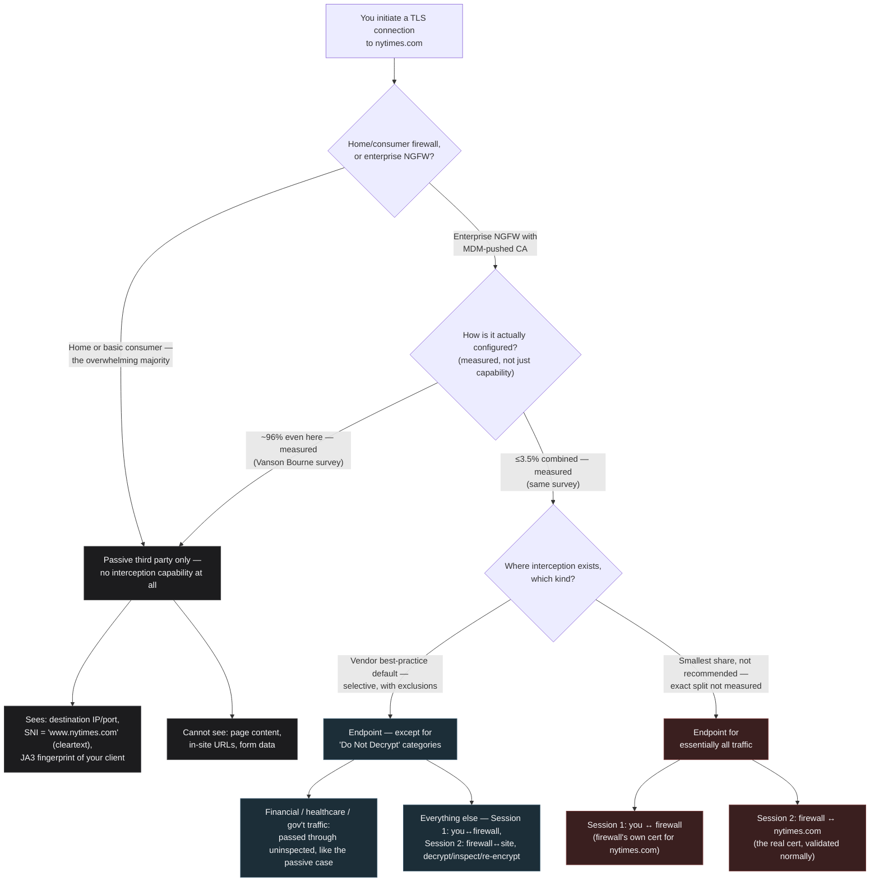

# How Does a Firewall "Look At" TLS-Encrypted Traffic?

**Question posed:** If I'm behind a firewall and initiate a connection to the NYT outside the firewall, the connection is encrypted with TLS. How does the firewall look at that traffic?

*Produced by The Nexus (Alexandria → Sherlock → Euclid → Popper → Seldon → Tufte → Turing → Alexandria) per the current [Nexus Workflow](https://github.com/raceBannon99/The-Nexus).*

---

## Bottom Line

A firewall that stays a passive third party can only ever see what TLS necessarily leaves outside the encryption boundary — destination IP, and (absent a newer, still-not-default protection) the hostname in the cleartext Server Name Indication field, plus a fingerprint of the handshake itself. To see the actual content, the firewall has to stop being a third party and become one of the two cryptographic endpoints — terminating its own TLS session with you and separately originating a second TLS session to the real destination. That's not TLS being broken; it's TLS working exactly as designed, authenticating a certificate authority your device was told to trust. The whole question of "can my firewall read my HTTPS traffic" reduces to one narrower factual question: does your device's trust store contain a CA certificate your network operator controls? That's a trust-store question, not a cryptography-strength question.

**Update (2026-07-23):** Even inside enterprises with that capability, blanket interception is not the documented norm. Measured adoption of full decrypt-and-inspect is low — one industry survey puts it at roughly 3.5% of organizations, despite 91% owning hardware capable of it — and where interception is deployed at all, the dominant vendor-recommended best practice is *selective*, not total: decrypt by default, then carve out standing "Do Not Decrypt" exclusions for financial, healthcare, and government traffic. See the expanded Sherlock section and Seldon's re-review below.

---

## Alexandria — What Do We Already Know? (Opening)

Checked Alexandria's Library (`nexus-artifacts`): nothing on point — the four archived artifacts (Evidence Tier Framework, D&D Alignment Chart, First Principles Infographic, B2C-Reach/B2B-Revenue Soundness Test) don't touch networking, cryptography, or firewalls.

Checked `raceBannon99/The-Nexus` for prior reports: no prior engagement has covered TLS, firewalls, or network traffic inspection — new ground.

## Sherlock — What Are the Facts?

**What's visible without decrypting anything:**

- **IP address, port, protocol** — ordinary L3/L4 visibility every firewall has.
- **Server Name Indication (SNI)** — defined in [RFC 6066](https://datatracker.ietf.org/doc/html/rfc6066), the TLS extension that lets a client tell a server which hostname it wants (needed because many sites share an IP address behind the same server/CDN). It's sent in the `ClientHello` — **in the clear, by default, even under TLS 1.3** — so a firewall can read `www.nytimes.com` directly off the wire without touching anything encrypted.
- **The server's certificate, under TLS 1.2** — sent unencrypted during the handshake. Under **TLS 1.3** ([RFC 8446](https://datatracker.ietf.org/doc/html/rfc8446)), the Certificate message is protected by the handshake traffic key derived right after the key exchange, so this particular leak closed when 1.3 became the default — but SNI, negotiated earlier in the same handshake, is unaffected by that change.
- **TLS/JA3 fingerprinting** — the specific cipher suites, extensions, and their ordering in the `ClientHello` form a stable fingerprint of the *client application* (not the content), independent of destination IP or domain. Invented at Salesforce in 2017 by John Althouse, Jeff Atkinson, and Josh Atkins; now supported by most major security platforms (Darktrace, Suricata, Zscaler, AWS/Azure/GCP firewalls, and more). The project's own examples: Tor's client fingerprint is stable at `e7d705a3286e19ea42f587b344ee6865`; Trickbot and Emotet malware each have their own stable JA3 hash regardless of which C2 domain or IP they're using that day. → [salesforce/ja3](https://github.com/salesforce/ja3)

**What requires the firewall to become an active party — TLS interception ("break-and-inspect"):**

A firewall configured for full content inspection terminates the client's TLS connection itself, using a certificate it generates on the fly (signed by an internal CA), then opens its own, separate TLS connection to the real destination. Two independent encrypted sessions exist — client↔firewall and firewall↔destination — and the firewall decrypts/re-encrypts on the boundary between them. This only avoids a certificate warning because the firewall's root CA is pre-installed in the device's trust store, typically pushed via enterprise MDM. The **NSA published a formal advisory on the risks of this practice** in December 2019, flagging (per corroborating summaries of the document) improper handling of decrypted traffic, downgraded TLS protection introduced by the inspecting appliance, and the CA itself becoming a high-value compromise target. → [NSA, "Managing Risk from Transport Layer Security Inspection," Dec. 2019](https://media.defense.gov/2019/Dec/16/2002225460/-1/-1/0/manage_risk_from_tls_inspection_20191216.pdf)

**Where this is heading — Encrypted Client Hello (ECH):** the IETF/Cloudflare/Mozilla/Fastly-developed successor to the earlier ESNI extension encrypts the *entire* `ClientHello`, including SNI, closing the metadata leak described above. As of Cloudflare's own account, ECH was, at time of writing, "not yet ready for Internet-scale deployment" — a real, standardized mechanism, but not yet the default anywhere near universally. → [Cloudflare, "Good-bye ESNI, hello ECH!"](https://blog.cloudflare.com/encrypted-client-hello/)

**A practical enterprise wrinkle — QUIC:** QUIC (HTTP/3) runs over UDP with its own encryption, bypassing the TCP-based point where a traditional inspecting firewall inserts itself. The well-documented enterprise response, confirmed across multiple independent vendor sources, is simply to **block QUIC outright**, forcing the client to fall back to TCP/TLS where inspection works normally. → [Microsoft Learn, "Understanding implications when using network intermediation"](https://learn.microsoft.com/en-us/security/zero-trust/network-intermediation) · corroborated by Zscaler, Palo Alto Networks LIVEcommunity, and Check Point CheckMates vendor documentation.

**How common is full TLS interception in enterprises, actually — and what does best practice say? (added 2026-07-23, follow-up to Rick's question)**

Adoption figures vary a lot across surveys and years — a recurring problem in this space, and worth flagging rather than papering over — but the direction is consistent: measured deployment of full decrypt-and-inspect lags far behind the *capability* to do it. A Vanson Bourne survey of 3,100 IT managers found 91% of surveyed organizations owned next-generation firewalls (NGFWs) capable of TLS/SSL inspection, but just **3.5%** reported actually decrypting and inspecting that traffic. The most-cited reason is performance cost: the same reporting cites independent testing showing TLS/SSL decryption cutting average NGFW throughput by roughly 60% and increasing latency by roughly 672% — steep enough that many IT managers leave decryption switched off even on hardware built to do it. → [Global Data Systems, "Why You Need the Ability to Inspect Encrypted Network Traffic"](https://www.getgds.com/resources/blog/cybersecurity/why-you-need-the-ability-to-inspect-encrypted-network-traffic), citing Statista and Vanson Bourne survey data.

Where organizations do intercept, the dominant documented best practice is **selective, not blanket**: decrypt by default, then maintain a standing "Do Not Decrypt" exclusion list for specific categories — financial services, healthcare, and government/legal sites are the near-universal first three, driven by compliance (HIPAA, banking regulation) and users' reasonable expectation of privacy on financial or medical sites. This is Palo Alto Networks' own documented recommendation — exclude such traffic via a "Do Not Decrypt" action, optionally still enforcing TLS/certificate validation on what's excluded — and the same category list turns up independently and repeatedly across practitioner discussion and vendor guidance. → [Palo Alto Networks, "Exclude Traffic from Decryption for Business, Legal, or Other Reasons"](https://docs.paloaltonetworks.com/network-security/pan-os/administration/decryption/decryption-exclusions/exclude-traffic-from-decryption-for-business-legal-or-other-reasons)

That the underlying visibility problem is taken seriously at the largest, most regulated enterprises — even though *full* interception adoption is measured as low — is corroborated by NIST's National Cybersecurity Center of Excellence, which ran a multi-year reference-architecture project on maintaining enterprise visibility as TLS 1.3's forward secrecy breaks older passive-decryption techniques, publishing the final practice guide in September 2025 with named industry collaborators including JPMorgan Chase, US Bank, F5, NETSCOUT, and DigiCert. → [NIST SP 1800-37, "Addressing Visibility Challenges with TLS 1.3 within the Enterprise" (Final, September 2025)](https://csrc.nist.gov/pubs/sp/1800/37/final)

## Euclid — What Must Be Fundamentally True?

Strip away vendor mechanics. Two things must be true simultaneously:

1. **Encryption is a property of the two endpoints, not a property of the wire.** TLS guarantees confidentiality between exactly the two parties who hold the negotiated keys. A firewall sitting on the path between client and server is, by definition, not one of those parties — unless it makes itself one.
2. **A firewall therefore has exactly two fundamentally different postures toward encrypted traffic, and nothing in between at the cryptographic level:**
   - **Stay a third party.** It can only ever see what TLS necessarily exposes outside the encryption boundary by protocol design (SNI, handshake fingerprint) or infer from ciphertext shape (packet size/timing) — it never touches the plaintext.
   - **Become an endpoint.** It terminates its own TLS session with the client and originates a second, separate TLS session to the real destination. It decrypts nothing it wasn't itself a legitimate cryptographic party to.

The second posture is only achievable, without the client's browser throwing a certificate error, because the client's device was configured in advance to trust an additional root CA the network operator controls. **This is not TLS's cryptography failing — TLS is doing exactly its job, authenticating whoever presents a certificate chaining to a trusted root.** The interception capability is a PKI/trust-store policy decision made before the connection ever happens, not a weakness discovered during the connection. So the question "can my firewall see my HTTPS traffic" reduces to a narrower, answerable factual question: **does this device's trust store contain a CA certificate my network operator controls?** — not a question about how strong TLS is.

## Popper — How Could We Be Wrong?

Four challenges, none left unaddressed:

**1. Calling the passive posture "no visibility" understates it.** SNI and JA3 fingerprinting give a firewall real, meaningful signal — domain names and malware-family identification — without decrypting anything. Presenting this as a clean binary (see everything / see nothing) misrepresents a spectrum as two points.

**2. The question says "a firewall," but most firewalls people actually sit behind — home routers, basic stateful firewalls — never do TLS interception at all.** Break-and-inspect is overwhelmingly a managed-enterprise-device phenomenon requiring MDM-pushed CA certificates. Answering as though every firewall does deep inspection risks badly miscalibrating the answer for a home-network reading of the question.

**3. Is it accurate that TLS 1.3 closes the certificate-in-the-clear gap without more nuance?** Yes for the Certificate message specifically — but SNI, negotiated earlier in the same handshake, is unaffected by that particular improvement, and conflating "TLS 1.3 encrypts more of the handshake" with "TLS 1.3 hides which site you're visiting" would be a real, avoidable error.

**4. Citing ECH as a mitigation without flagging its deployment status overstates present-day protection.** Cloudflare's own source material frames ECH as not yet ready for internet-scale deployment — citing it without that caveat implies a level of real-world SNI protection that doesn't broadly exist yet.

## Seldon — Resolving Popper, and What's Likely Next

**On #1 (binary understates the passive posture):** *Revised.* The Bottom Line and Sherlock's section above are restructured around three tiers, not two: passive metadata-only visibility (IP/port/SNI), active fingerprinting (JA3, still no decryption), and full interception (becoming an endpoint). This is reflected in Tufte's diagram below.

**On #2 (most firewalls don't intercept):** *Stood by, stated explicitly rather than left implicit.* Full TLS interception is essentially never present on a home router or a basic consumer firewall — it requires an enterprise-managed device with a network-operator-controlled CA already installed, typically via MDM. Absent that specific setup, "how does the firewall look at that traffic" has a much shorter answer: SNI and fingerprinting only.

**On #3 (TLS 1.3 nuance):** *Revised.* Sherlock's section above now states plainly that SNI remains cleartext by default under TLS 1.3 even though the Certificate message is now encrypted — two different parts of the same handshake, improved on different timelines.

**On #4 (ECH deployment caveat):** *Revised.* The ECH discussion above now states Cloudflare's own "not yet ready for Internet-scale deployment" framing directly, rather than presenting ECH as a mitigation already broadly in effect.

**Forecasts** — expressed as a range with a median, in plain language, per standing convention:

- **Time until Encrypted Client Hello (or an equivalent full-handshake-encryption mechanism) becomes the deployed default across major browsers and CDNs**, such that SNI-based firewall visibility mostly disappears for traffic to major sites: **the range runs from about 2 years to 10+ years (or this may never reach full default-on deployment), with a median around 5 years.** The near end reflects that meaningful pieces (Cloudflare's edge support, Firefox's experimental opt-in) already exist today; the long tail reflects the same "network ossification" problem Cloudflare's own account describes with TLS 1.3's rollout — middleboxes that don't understand a changed handshake tend to break in unpredictable ways, and fixing that at internet scale has historically taken years, not months.
- **Share of enterprise firewalls that respond to wider ECH deployment by simply blocking non-decryptable connections outright** (the same pattern already used against QUIC today) rather than tolerating reduced visibility: **the range runs from about 30% to 70%, with a median around 50%.** The median reflects strong precedent — QUIC-blocking is already standard, well-documented practice across Zscaler, Palo Alto, and Check Point's own guidance — but the wide band reflects real uncertainty about whether compliance/privacy pressure and vendor UX concerns temper that instinct for encrypted-handshake traffic the way they haven't yet for QUIC. **Treat this as reasoned judgment, not a measured statistic** — no survey of actual enterprise firewall configurations was collected for this estimate.

## Popper — Re-Review (Update Pass, 2026-07-23)

Rick's follow-up question surfaces new data that touches Challenge #2 directly, so per the Nexus's update-pass rules, that resolution gets re-reviewed rather than silently amended.

**Does the new adoption data overturn the original resolution?** No — but it exposes a gap the original phrasing left open. The original resolution said full interception "requires an enterprise-managed device with a network-operator-controlled CA already installed" and is "essentially never present" on a home router. That's still true. But it risked leaving an unstated implication: that *within* the enterprise population, having the capability means the practice is common. The new data says otherwise — even restricted to enterprises that own inspection-capable NGFWs, actually performing full decrypt-and-inspect is a minority practice (roughly 3.5% per the Vanson Bourne data), and where interception is deployed at all, the documented best practice explicitly recommends *against* decrypting everything, carving out standing exclusions instead. **"Enterprise phenomenon" was accurate but incomplete — it should not be read as "enterprise default."**

## Seldon — Resolving the Re-Review

*Revised, narrowing rather than reversing the original resolution.* The accurate framing has three tiers within the enterprise population specifically, not two:

1. **No interception deployed at all** — still a substantial share of the 91% who own capable NGFWs, per the Vanson Bourne data, largely for performance reasons (measured throughput/latency cost cited above).
2. **Selective interception with standing category exclusions** ("Do Not Decrypt" for financial, healthcare, government/legal traffic) — the best-documented, most vendor-recommended posture where interception is deployed at all, per Palo Alto's own guidance and echoed consistently elsewhere.
3. **Full, blanket interception of essentially all traffic** — the smallest and least-recommended slice, not the norm even inside organizations equipped to do it.

Direct answer to "do most organizations configure TLS intercept": **no, not in the blanket sense** — measured full-decryption adoption is low even where the hardware supports it, and best practice explicitly steers organizations toward tier 2 (decrypt-with-named-exclusions) rather than tier 3 (decrypt-everything). This doesn't change the report's existing forecasts (both concern ECH/QUIC-era visibility trends, not present-day interception adoption rates), so they stand as published below.

## Tufte — Seeing the Postures (second redraw, 2026-07-23, against the fuller reference set)

**Why this diagram changed again.** Since the first redraw (preserved below for the record), Agent Tufte's reference material grew substantially: the fact-sheet gained the Six Fundamental Principles of Analytical Design and a set of table/typography rules, a worked example (the Truthfulness vs. Density quadrant image) showing those principles actually executed, and a private style reference for general visual polish (not reproduced here — see `Agent Tufte Concept.md` for why). Re-checking the prior redraw against the newly-available **Documentation** principle ("thoroughly describe the evidence") and **Comparisons** principle ("always ask compared to what") surfaced one real gap: the diagram's edge labels asserted "majority," "best-practice default," and "rare" without saying which of those are measured survey data and which are vendor guidance — exactly the kind of undocumented evidence-tier gap the Evidence Tier Framework and this fact-sheet both exist to catch. Two concrete changes below, not cosmetic churn:

1. **Documentation:** edge labels now state plainly which claims are measured (the Vanson Bourne survey figures already cited in Sherlock's section above) versus qualitative/best-practice guidance versus a point where the underlying data simply doesn't support a precise split.
2. **Comparisons:** the "no interception" and "some interception" edges now carry the actual approximate shares derived directly from the already-cited survey (96% / ≤3.5%), rather than the vaguer "majority"/"rare" wording — but the diagram stops short of inventing a precise measured split between "selective" and "blanket" within that ≤3.5%, because no such split was measured. Overclaiming precision there would be exactly the "well-designed lie" quadrant from Agent Tufte's own reference image — dense but dishonest.

Color still carries the same three real distinctions as before, unchanged: grey for "no visibility beyond protocol-necessary leakage" (home router or enterprise-with-decryption-off — same outcome, same color, on purpose), blue for the documented best-practice posture, red for the smallest and least-recommended slice. The two new decision points (`E`'s numbers, `H`'s split) stay uncolored like the diagram's other two decision diamonds (`B`), consistent with the fact-sheet's table/typography rule that color should mark a real category distinction, not decorate a structural node — a decision point isn't a category, so it doesn't get one.

**One deliberate departure from the fact-sheet's letter, stated rather than left implicit:** the table/typography rules say gray is the default color reserved for context (gridlines, backgrounds), not data. Here, grey *is* one of three data-bearing categories, not background decoration. That rule was written for tables and charts with axes; this is a categorical flow diagram, where color legitimately marks category membership. Applying the rule literally would mean removing grey's meaning entirely — worse, not better — so the underlying principle (color must earn its place, never decorate) is honored while the specific prescription is adapted to a different diagram type, per the fact-sheet's own guidance on applying Tufte's work at the level of intent rather than literal print-era tactics.

*For the historical record, both the original two-tier version and the first three-tier redraw are preserved in this file's git history (commits `61fbc49` and `7296af2`) rather than deleted — only the currently published version changes.*

## Turing — Anything Become a Skill?

Checked with each stage on this pass. Nothing here rises to a reusable, automatable skill — the research was general-purpose lookups against public documentation (RFCs, an NSA advisory, a vendor blog, vendor forums), and Euclid's reduction is one-off reasoning for this specific question. **No new skill built this round.**

---

## Library Recommendations

| Candidate | Category | Recommended by | Rationale | Status |
|---|---|---|---|---|
| Encrypted-Traffic Visibility Test | fact-sheet | Alexandria, synthesizing Euclid's endpoint-vs-third-party reduction and the three-tier model (passive metadata / active fingerprinting / full interception) | Generalizes past firewalls specifically — the same reduction ("can this observer become a cryptographic endpoint, or is it stuck reading only what the protocol necessarily leaks?") applies to VPNs, proxies, mesh-network observers, or any future "can X see my encrypted Y" question brought to the Nexus. Same category of reusable methodology as the Evidence Tier Framework and the B2C/B2B Soundness Test. | Recommended — awaiting Rick's decision, not yet submitted as a Pull Request |

No other candidates were flagged this round — the specific facts about SNI, JA3, ECH, and QUIC-blocking are case facts supporting this answer, not reusable frameworks in themselves.

---

## Sources

**Primary/official (Tier 1 — standards bodies and the US government):**
- [IETF, RFC 6066 — TLS Extension Definitions (Server Name Indication)](https://datatracker.ietf.org/doc/html/rfc6066) — defines the SNI extension and its cleartext transmission in the `ClientHello`.
- [IETF, RFC 8446 — The Transport Layer Security (TLS) Protocol Version 1.3](https://datatracker.ietf.org/doc/html/rfc8446) — defines TLS 1.3's handshake encryption, including the Certificate message's protection under the handshake traffic key.
- [NSA, "Managing Risk from Transport Layer Security Inspection," December 2019](https://media.defense.gov/2019/Dec/16/2002225460/-1/-1/0/manage_risk_from_tls_inspection_20191216.pdf) — official US government advisory on TLS break-and-inspect risks (PDF is canvas-rendered; content corroborated via multiple independent secondary summaries quoting the same document, including Calyptix Security and WaterISAC).
- [NIST SP 1800-37, "Addressing Visibility Challenges with TLS 1.3 within the Enterprise" (Final, September 2025)](https://csrc.nist.gov/pubs/sp/1800/37/final) — NCCoE reference-architecture project on maintaining enterprise TLS visibility, with named industry collaborators (JPMorgan Chase, US Bank, F5, NETSCOUT, DigiCert); supports the claim that visibility/inspection is a serious concern for large regulated enterprises even where full-interception adoption is measured as low.

**Technical/forensic (Tier 1 — created by the original authors of the technique):**
- [salesforce/ja3 — GitHub](https://github.com/salesforce/ja3) — JA3/JA3S TLS fingerprinting, documented directly by its creators (John Althouse, Jeff Atkinson, Josh Atkins), including the Tor/Trickbot/Emotet fingerprint examples cited above.
- [Cloudflare, "Good-bye ESNI, hello ECH!" (Christopher Patton, Dec. 2020)](https://blog.cloudflare.com/encrypted-client-hello/) — the most complete public account of why SNI leaks today, ESNI's predecessor mechanism, and ECH's design and deployment status.

**Vendor/practitioner documentation (Tier 2 — corroborated across multiple independent sources):**
- [Microsoft Learn, "Understanding implications when using network intermediation"](https://learn.microsoft.com/en-us/security/zero-trust/network-intermediation) — QUIC-blocking-to-force-TLS-fallback as standard enterprise practice.
- Corroborating vendor sources for the same QUIC-blocking practice (not independently fetched in full, cross-checked via search snippets only): Zscaler product documentation and white papers, Palo Alto Networks LIVEcommunity forum guidance, Check Point CheckMates community guidance.
- [Global Data Systems, "Why You Need the Ability to Inspect Encrypted Network Traffic"](https://www.getgds.com/resources/blog/cybersecurity/why-you-need-the-ability-to-inspect-encrypted-network-traffic) — cites Statista (63%/23% extensive/partial TLS-SSL use) and a Vanson Bourne survey of 3,100 IT managers (91% own capable NGFWs, 3.5% actually decrypt/inspect) plus NGFW performance-cost figures for decryption.
- [Palo Alto Networks, "Exclude Traffic from Decryption for Business, Legal, or Other Reasons"](https://docs.paloaltonetworks.com/network-security/pan-os/administration/decryption/decryption-exclusions/exclude-traffic-from-decryption-for-business-legal-or-other-reasons) — vendor's own official documentation of the "Do Not Decrypt" category-exclusion best practice (financial, healthcare, government/legal), cross-checked against consistent independent practitioner guidance (r/paloaltonetworks, and multiple vendor/practitioner write-ups describing the same category list).

**Internal (Nexus artifacts library):**
- [Edward Tufte: Work, Principles, and Practical Tests](https://github.com/raceBannon99/nexus-artifacts/blob/main/fact-sheets/edward-tufte-visualization-principles.md) — Agent Tufte's standing reference, applied directly in both redraws of this report's diagram (truthfulness/density test, semantic-color-only-where-it-marks-a-real-distinction; second redraw also applies the Documentation and Comparisons principles).
- [Truthfulness vs. Density Quadrant](https://github.com/raceBannon99/nexus-artifacts/blob/main/fact-sheets/edward-tufte-truthfulness-density-quadrant.png) — Agent Tufte's own worked example, consulted as a model of the "well-designed lie" failure mode this redraw specifically avoided (not overclaiming a measured split that doesn't exist).
- [The Da Vinci of Data (Buteau style reference)](https://github.com/raceBannon99/nexus-artifacts/blob/main/images/the-da-vinci-of-data-tufte-principles-by-antoine-buteau.png) — consulted for general visual restraint/polish only, per its recorded usage restriction; not reproduced.
