# Saudi Aramco (Shamoon) Hack — Cyber Kill Chain Analysis

*Produced by The Nexus per the current [Nexus Workflow](https://github.com/raceBannon99/The-Nexus). Format follows the precedent set by the [Harmony Horizon Bridge kill-chain report](https://github.com/raceBannon99/The-Nexus/blob/main/reports/2026-07-15-harmony-bridge-kill-chain.md) — a topic-organized intelligence brief rather than agent-labeled headers, since that structure already proved itself for this exact report type. The Evidence Tier Framework (Tier 1/2/3, first used in that same report) is applied throughout.*

## Bottom Line

On August 15, 2012, at 11:08 a.m. local time — the exact moment most of Saudi Aramco's 55,000 employees were away from their desks for Lailat al-Qadr, one of Ramadan's holiest nights — a wiper called Shamoon (W32.Disttrack) detonated across the company's internal corporate network, destroying data on roughly three-quarters of its business PCs (reported as 30,000 to 35,000 machines depending on the source) and replacing it with an image of a burning American flag. A group calling itself "Cutting Sword of Justice" claimed responsibility within hours, framing it as retaliation for Saudi regional policy. U.S. intelligence officials blamed Iran — without, by the reporting's own account, disclosing evidence for that claim.

This is a genuinely different kind of kill chain than the Nexus's prior kill-chain analysis (Harmony Bridge): that was an espionage-then-theft operation where every phase mattered to a patient, covert intrusion. This one is a **destructive, denial-of-service-style sabotage attack** where the payoff is realized instantly at detonation, not through sustained covert access — and, remarkably, the malware's own command-and-control module was found to be functionally broken, meaning the entire operation ran on a hardcoded timer rather than live attacker control. The single most consequential fact in this whole incident may not even be part of the kill chain at all: Aramco's production network (drilling, pumping) was physically and logically segregated from the corporate IT network that Shamoon hit, so oil kept flowing at roughly 9.5 million barrels a day throughout — a pre-existing architectural decision, made before this attack ever began, that turned what could have been a physical/safety catastrophe into "merely" a business-continuity crisis that took about five months to fully resolve.

**The central open question this brief cannot resolve, because public reporting itself doesn't agree:** how did the attackers actually get in? Three different, materially incompatible accounts exist in public reporting — a company insider deliberately introducing the malware (possibly via USB), an unwitting employee duped by a phishing email, and a generic "the malware spread from an infected machine" framing that begs the same question — and this brief presents all three rather than silently picking one.

## The Kill Chain, Phase by Phase

Each phase is labeled with its evidence tier, per the Evidence Tier Framework: **Tier 1** facts are multi-sourced and independently verifiable (here: primary technical malware analysis converging across independent security vendors, or facts reported identically across independent contemporaneous outlets). **Tier 2** claims are sourced to a limited number of accounts — a single named individual's later recollection, or unnamed sources cited by one investigative report — and should be read as exactly that. **Tier 3** content is either a total public evidentiary gap or imported by analogy from a different case, and is flagged explicitly.

### 1. Reconnaissance — Tier 3 (total gap)
No public reporting — from the original 2012 technical write-ups, contemporaneous journalism, or later retrospectives — describes how or when the attackers cased Aramco's network before the intrusion. Unlike the Harmony Bridge report, where Harmony itself claimed server logs showed pre-attack reconnaissance from a specific date, there is no equivalent claim here at all. This phase is simply unknown, not thinly evidenced.

### 2. Weaponization — Tier 1 for *what the malware does*, Tier 3 for *how/when it was built*
Independent technical analysis from Kaspersky, Symantec, and Seculert — all working from real malware samples within days of the attack — converges on the same picture: a roughly 900KB Windows PE file containing encrypted resources, a file-enumeration component that catalogs documents/downloads/pictures/videos/desktop contents, and a destructive payload built around a **legitimately signed EldoS Corporation disk driver**, repurposed for raw disk access to overwrite the Master Boot Record. That the malware *exists and does this* is Tier 1 — multiple independent vendors examined actual samples and agree. But *who built it, when development started, and how it was tested* is a complete public gap — no attacker toolset, development timeline, or internal build artifact has ever been disclosed.

### 3. Delivery — Tier 2, and the report's central unresolved discrepancy
This is where public reporting genuinely disagrees, not just varies in detail — see "The Evidence Discrepancies" section below for the full comparison. In brief: the *New York Times* (Oct. 2012, citing security researchers and "two people close to the investigation") reported that the malware was unleashed by "a person with privileged access to the [company's] computers" and that "the virus could have been carried on a USB memory stick that was inserted into a PC." A 2015 Black Hat talk by Chris Kubecka, a security consultant hired by Aramco *after* the incident (reported via CNNMoney, and never confirmed by Aramco itself), instead describes an IT technician being duped by a phishing email and clicking a malicious link. These are not compatible framings of the same event — one describes a deliberate insider act, the other an unwitting victim.

### 4. Exploitation — Tier 3 (gap)
No CVE, specific software vulnerability, or exploit chain has ever been publicly disclosed for how the malware actually achieved execution on the first infected machine. This is consistent with either delivery narrative (a privileged insider needs no exploit to run something directly; a phishing link could have led to a malicious attachment without a named vulnerability ever being disclosed) — but the mechanism itself remains undocumented either way.

### 5. Installation — Tier 1
Well-documented technically: the file-enumeration commands, the signed EldoS driver used for raw MBR access, and the final overwrite mechanism (files replaced with corrupted, unrecoverable data, then the MBR overwritten with a JPEG fragment of a burning American flag) are all confirmed directly from Kaspersky's analysis of actual malware samples, published within a day of the attack. Seculert's contemporaneous analysis (referenced in, though not independently verified beyond, Kaspersky's own Aug. 17, 2012 update) described a two-stage attack with lateral movement across the network — consistent with the roughly 30,000-35,000-machine blast radius.

### 6. Command and Control — Tier 1, with a specific and important nuance
The malware included a communication module (compiled as NETINIT.EXE) designed to report to a hardcoded C2 address and, in principle, receive a command overriding the malware's hardcoded wipe date. Kaspersky's technical analysis found a programmer error — a malformed format string — that meant this remote-command capability **did not actually function** in the observed 2012 sample. The attack instead executed via a hardcoded kill-switch timer set for 11:08 a.m., matching the exact observed detonation time. This is a materially significant, well-sourced technical fact: genuine, live command-and-control was not necessary for this attack to succeed.

### 7. Actions on Objectives — Tier 1
At 11:08 a.m. on August 15, 2012, the wipe fired across the network: data on an estimated 30,000-35,000 machines (roughly three-quarters of Aramco's corporate PCs) was destroyed and MBRs overwritten with the burning-flag image; infected-machine IP addresses were collected and later published publicly as proof of the attack. "Cutting Sword of Justice" claimed responsibility the same morning. Aramco's IT staff physically disconnected offices worldwide from the internet to halt the spread. Fourteen days later, on August 29, the same actors posted a further batch of Aramco usernames and passwords online — including the CEO's — demonstrating they still had some form of access to company systems after the initial wipe, a second, distinct "actions on objectives" moment. Throughout, Aramco's oil production and exploration systems — physically and logically segregated from the corporate network — were unaffected; production held steady at roughly 9.5 million barrels a day.

## Attribution: How Solid Is "Iran"?

Read this as **asserted by U.S. officials without disclosed evidence, supported by circumstantial code/motive clues, and never formalized in an on-the-record indictment or named press release the way the Harmony/Lazarus attribution eventually was** — not as settled fact.

- U.S. intelligence officials attributed the attack to Iran; the *New York Times*' own account is explicit that "they offered no specific evidence to support that claim." Then-Secretary of Defense Leon Panetta separately cited the Aramco attack as "a significant escalation of the cyber threat" in a public speech — a comment about severity, not an attribution statement, and the two should not be conflated.
- Circumstantial clues cited by analysts: the malware's internal code contained the string "Arabian Gulf" — a naming choice Iran's government has publicly and vocally rejected (Iran insists on "Persian Gulf" and has threatened legal action over map labels using the alternative) — read as a possible, not conclusive, misdirection-away-from-Iran clue that could equally be a deliberate false flag *toward* Iran by someone else. Analysts also noted the malware's destructive component was internally named "Wiper" by its own authors, the same name given to a data-erasing tool used in an April 2012 attack on Iran's oil ministry and Kharg Island oil terminal (widely linked to the Flame espionage platform, itself attributed by other reporting to the U.S./Israel) — raising a retaliation theory.
- **This retaliation theory runs directly into forensic skepticism from the malware researchers themselves.** Kaspersky's own technical assessment, published the day after the Aramco attack was discovered, explicitly compared the two tools and concluded they are *not* the same malware — different service names, different driver filenames, a different disk-wiping pattern — and assessed the Aramco sample was more likely an independently written "copycat," possibly even amateur work, inspired by the earlier story rather than a continuation of it. Later *New York Times* reporting leans into the shared-name/retaliation narrative without directly addressing this forensic disagreement.
- No U.S. government agency has ever issued a formal, named press release or indictment attributing the 2012 Aramco attack to Iran or any specific individual — a materially weaker, less formalized attribution posture than the Harmony Bridge precedent, where the FBI issued a named press release in January 2023.
- A similar attack hit RasGas, the Qatari natural-gas company, roughly two weeks after Aramco; U.S. intelligence attributed that one to Iran as well, reinforcing a pattern without independently proving either case.
- Independent researchers cited by the *New York Times* describe the "Cutting Sword of Justice" hacktivist messaging and the burning-flag imagery as **"probably red herrings"** — meaning the publicly visible "why" (political grievance) may itself be attacker misdirection layered on top of whatever the real sponsor's actual motive was.
- Later, better-attributed campaigns lend the theory retrospective plausibility without proving the original case: Shamoon resurfaced in 2016-2017 ("Shamoon 2," alongside a related wiper called StoneDrill) and again in 2018 ("Shamoon 3," paired with a new file-deletion tool called Filerase), hitting further Gulf-region energy organizations. McAfee attributed the 2016-2017 wave to APT33 ("Elfin"), a group widely assessed as Iran-linked (not independently verified in full here, cross-checked via search snippet only) — but that is evidence about a *later, different* campaign using the same malware family, not new evidence about who operated the original 2012 attack.

## The Evidence Discrepancies, Stated Plainly

**How did the attackers actually get in?** Three accounts exist and they are not reconcilable into one story with the information public today:

| Source | Date / Type | Mechanism claimed | Sourcing |
|---|---|---|---|
| *New York Times* (Nicole Perlroth) | Oct. 2012, investigative journalism | A person with privileged access personally unleashed the virus; researchers say it could have been carried on a USB stick | Cites named/described security researchers and "two people close to the investigation," not on the record by name |
| NATO CCDCOE international cyber law toolkit | Undated reference wiki, citing the *Times* piece above | States plainly the virus was "unleashed... by a company insider with privileged access" | Secondary source citing the *Times* article directly — not independent corroboration |
| Chris Kubecka, security consultant (via CNNMoney) | Aug. 2015, Black Hat conference talk, 3 years after the fact | An IT technician was duped by a phishing email and clicked a malicious link | Single named individual's account; Aramco did not respond to CNNMoney's request to confirm it |

The first two rows describe the same underlying claim (an insider, possibly with a USB device) and share a common origin (the *Times* article) rather than being truly independent — so treat them as one account, not two. That one account still directly contradicts Kubecka's phishing narrative on the most basic question a kill-chain analysis has to answer: was this attack enabled by a **malicious insider acting deliberately**, or an **unwitting employee tricked by an outsider**? Those are different threat models with different defensive implications, and this brief cannot adjudicate between them with what's publicly available.

A smaller, secondary discrepancy: the affected-machine count is reported as "30,000" (CFR, contemporaneous NBC coverage), "over 30,000" (CCDCOE), and "35,000" (Kubecka/CNNMoney, 2015) — all in the same rough order of magnitude, and likely a matter of when in the incident the count was taken or which category of machine was counted, but never precisely reconciled across sources.

## What Doesn't Depend on the Disputed Details

Three structural facts hold regardless of which delivery narrative is correct:

1. **This was a destructive, not an espionage, operation** — its value to the attacker was realized instantly at the moment of detonation, not accumulated through sustained covert presence. That changes what "breaking the kill chain" would even mean compared to an intrusion built for data theft.
2. **Command-and-control did not need to actually work for the attack to succeed.** The malware's C2 module was found to be functionally broken; the wipe fired off a hardcoded timer instead. A defensive strategy built around disrupting C2 traffic — a mainstay of the classic kill-chain model's own logic — would not have stopped this attack once installation had occurred.
3. **Network segregation between IT and OT was the single fact that bounded the damage to business paralysis rather than physical/production consequences**, and that was an architectural decision made long before this kill chain ever started — not a phase of the attack at all, but the reason the attack's worst-case outcome never happened.

(One candidate invariant was considered and rejected: "this required nation-state-level technical sophistication." Kaspersky's own contemporaneous assessment floated the possibility of amateur or "script kiddie" work before the Iran theory gained traction, and Richard Clarke's on-the-record assessment — "you don't have to be sophisticated to do a lot of damage" — argues the damage scaled from network architecture and privileged reach, not exploit elegance. Sophistication is not established as a structural fact here.)

## Forward Look: What's Likely Next

Expressed as ranges with a median, in plain language, per standing convention — not single-point probabilities:

- **Chance that a specific individual or unit is ever publicly indicted for the 2012 Aramco attack specifically** (the way DPRK's Park Jin Hyok eventually was for Sony/Lazarus): **the range runs from about 5% to 20%, trending toward "most likely never."** Fourteen years have passed with no individual ever named. The Aramco attribution was also never formalized the way Harmony's was (no named FBI press release, no DOJ indictment) — a weaker starting position than the DPRK cases that eventually did produce named individuals. There's also no equivalent of the "follow the blockchain" forensic hook that drives individual attribution in crypto-theft cases; a 2012 wiper attack against a foreign state oil company simply doesn't generate the same kind of enforceable evidentiary trail. **Treat this as reasoned judgment** — no formal base rate for "wiper attacks against foreign critical infrastructure that eventually produce a named indictment" was located or computed.
- **Share of major future energy-sector cyberattacks that successfully cross from IT into OT/production systems**, rather than stopping at business-network disruption the way Aramco did: **the range runs from about 10% to 35%, with a median around 20%.** The low end reflects that IT/OT segregation — the exact lesson this incident is remembered for — has become a much more deliberate design principle industry-wide since 2012. The high end reflects real counter-precedent that already exists elsewhere: Ukraine's power grid was attacked twice (2015 and 2016) with attackers successfully crossing into OT and causing actual blackouts, not just IT disruption. Colonial Pipeline (2021) sits in between — an IT-only ransomware attack that caused a *precautionary* OT shutdown rather than a direct OT compromise. **This is reasoned judgment across a small number of high-profile cases, not a measured statistic** — there is no comprehensive, verifiable dataset of "energy-sector attacks that did or didn't cross into OT" to draw a real base rate from.

## Tufte — Seeing the Kill Chain

Two visualizations, built against Agent Tufte's standing reference (the [Edward Tufte fact-sheet](https://github.com/raceBannon99/nexus-artifacts/blob/main/fact-sheets/edward-tufte-visualization-principles.md) and its [worked quadrant example](https://github.com/raceBannon99/nexus-artifacts/blob/main/fact-sheets/edward-tufte-truthfulness-density-quadrant.png)): the delivery-discrepancy table above already applies the "show comparisons" analytical-design principle directly — three accounts, same dimensions, side by side, no narrative picking a winner. Below is the phase-by-phase kill chain itself, colored by evidence tier so the diagram's own honesty about *what's actually known* is visible at a glance, not just stated in prose.

```mermaid
flowchart LR
    R["1. Reconnaissance<br/>No public evidence at all"] --> W["2. Weaponization<br/>Malware itself: well-documented<br/>Who built it: unknown"]
    W --> D["3. Delivery<br/>Disputed — insider+USB (NYT)<br/>vs. phishing (Kubecka, 2015)"]
    D --> E["4. Exploitation<br/>No CVE or exploit chain<br/>ever disclosed"]
    E --> I["5. Installation<br/>EldoS driver abused for raw MBR access;<br/>file enum, lateral spread"]
    I --> C["6. Command &amp; Control<br/>Present in code but broken —<br/>hardcoded timer fired instead"]
    C --> A["7. Actions on Objectives<br/>11:08am detonation, ~30-35k machines,<br/>burning-flag MBR overwrite, IPs published"]

    classDef gap fill:#3a1f1f,stroke:#7a3b3b,color:#f5f5f7;
    classDef disputed fill:#3a331f,stroke:#7a6b3b,color:#f5f5f7;
    classDef solid fill:#1c2e38,stroke:#3b5a6e,color:#f5f5f7;
    class R gap;
    class D disputed;
    class E gap;
    class W,I,C,A solid;
```

Color marks a real distinction, not decoration: red for a total public evidentiary gap (Reconnaissance, Exploitation), amber for actively disputed accounts (Delivery), blue for phases with solid, multi-sourced technical documentation (Weaponization's malware characteristics, Installation, C2, Actions on Objectives). The diagram makes a fact visible that's easy to lose in prose: the two phases where a defender might classically intervene — Exploitation and Reconnaissance — are exactly the two phases this incident's public record says the least about.

## Open Questions

- Which delivery narrative is correct — a malicious insider (possibly via USB), or an unwitting employee duped by phishing? Public reporting offers no way to adjudicate between them.
- Was "Cutting Sword of Justice" an independent hacktivist group, a witting front for a state sponsor, or an entity claiming credit for an operation it didn't actually run?
- Does Shamoon genuinely share code lineage with the April 2012 "Wiper" component tied to Flame, or is Kaspersky's contemporaneous "copycat" assessment the more defensible technical read against the *Times*'s retaliation-narrative framing?
- Why did the attackers surface again on August 29 to publish credentials, including the CEO's, rather than staying silent after the initial wipe — does that pattern favor a "make a public statement" motive over a quiet state-intelligence operation?
- Has any government, in the fourteen years since, ever disclosed the actual evidence behind the Iran attribution, rather than an unsupported assertion?

## What This Means for Rick

This incident is remembered, correctly, as a landmark case in the history of destructive cyberattacks — the moment a major, real-world industrial company got wiped nearly to the studs by a piece of malware unsophisticated enough that its own creators apparently botched the command-and-control code. But the public record underneath that famous story is thinner and more contested than the "Iran did this with a phishing email" version that circulates informally: attribution to Iran was never formally disclosed with evidence, was never made official the way it eventually was for Harmony/Lazarus, and rests partly on a retaliation narrative (the shared "Wiper" name) that the malware's own first forensic analysts pushed back on the same week. And the most basic operational fact — how the attackers got that first foothold — has two incompatible public answers three years apart, from a contemporaneous investigative report and a later single-source conference talk, neither ever confirmed by Aramco itself. The one fact that isn't in dispute, and arguably the most important lesson from the whole affair, is architectural rather than forensic: because Aramco's production network was segregated from its corporate network before this attack ever happened, a company that lost three-quarters of its business PCs never lost a barrel of oil.

---

## Library Recommendations

| Candidate | Category | Recommended by | Rationale | Status |
|---|---|---|---|---|
| Cyber Kill Chain + Evidence Tier Analysis Template | fact-sheet | Alexandria, generalizing the structure used both in the Harmony Bridge report and this report | This is the second time the Nexus has produced an evidence-tiered, phase-by-phase kill-chain analysis (Lockheed Martin's 7 stages, per-phase Tier 1/2/3 labeling, an explicit "Evidence Discrepancies" section, an explicit "What Doesn't Depend on Disputed Details" invariant-extraction step, and a plain-language range-forecast close). Two independent uses is exactly the threshold for treating a report-specific structure as a reusable methodology rather than a one-off. Same category of durable, cross-report reference as the Evidence Tier Framework itself. | Recommended — awaiting Rick's decision, not yet submitted as a Pull Request |

No other candidates were flagged this round — the specific facts about Shamoon, attribution, and the delivery discrepancy are case facts supporting this analysis, not reusable frameworks in themselves.

---

## Sources

**Primary/technical (Tier 1 — independent malware analysis from original samples):**
- [Kaspersky Securelist — "Shamoon the Wiper – Copycats at Work"](https://securelist.com/shamoon-the-wiper-copycats-at-work/57854/) (Aug. 16, 2012) — original technical analysis; malware characteristics, EldoS driver, explicit comparison against and rejection of code-lineage with the April 2012 Iran "Wiper"; low telemetry sightings (targeted, not widespread).
- [Kaspersky Securelist — "Shamoon the Wiper: Further Details (Part II)"](https://securelist.com/shamoon-the-wiper-further-details-part-ii/57784/) (Sept. 11, 2012) — C2 module detail and the programmer error that broke remote command execution; the hardcoded kill-switch timer; the burning-flag JPEG fragment detail.
- [Symantec/Security.com — "Shamoon: Destructive Threat Re-Emerges with New Sting in its Tail"](https://www.security.com/threat-intelligence/shamoon-destructive-threat-re-emerges-new-sting-its-tail) — technical detail on the 2018 Shamoon 3/Filerase variant, used here only for later-campaign context, clearly distinguished from 2012-specific claims.

**Primary/journalistic (Tier 2 — named reporter, described-but-unnamed sources):**
- [*The New York Times* (Nicole Perlroth) — "In Cyberattack on Saudi Firm, U.S. Sees Iran Firing Back"](https://www.nytimes.com/2012/10/24/business/global/cyberattack-on-saudi-oil-firm-disquiets-us.html) (Oct. 23, 2012) — the single richest source in this report: exact detonation time, the insider/USB delivery account, the "Arabian Gulf" naming clue, the "probably red herrings" assessment of the hacktivist messaging, RasGas as a follow-on attack, and on-record quotes from Richard Clarke and James Lewis.
- [CNNMoney — "The inside story of the biggest hack in history"](https://web.archive.org/web/20201229141509/https://money.cnn.com/2015/08/05/technology/aramco-hack/) (Aug. 5, 2015; original URL now dead, retrieved via Wayback Machine per standing Chrome-MCP-retry rule) — Chris Kubecka's single-sourced, Aramco-unconfirmed phishing account; the oil-production-unaffected detail; the five-month full-recovery timeline; the 50,000-hard-drive purchase and its effect on global HDD supply.

**Institutional/reference (Tier 2 — secondary, citing the above):**
- [NATO CCDCOE — "Shamoon (2012)," International Cyber Law: Interactive Toolkit](https://cyberlaw.ccdcoe.org/wiki/Shamoon_(2012)) (WebFetch returned HTTP 403; retrieved via Chrome MCP navigate + get_page_text per standing rule) — restates the *Times*' insider-access claim; confirms the Aug. 29 credential-dump follow-on event; notes the 2016 Shamoon resurgence.
- [Council on Foreign Relations — Cyber Operations Tracker, "Compromise of Saudi Aramco and RasGas"](https://www.cfr.org/cyber-operations/compromise-of-saudi-aramco-and-rasgas) — general incident summary and RasGas cross-reference.

**Later-campaign attribution (Tier 2 — not independently fetched in full, cross-checked via search snippets only):**
- McAfee's December 2018 attribution of the 2016-2017 Shamoon 2/StoneDrill wave to APT33 ("Elfin"), corroborated via search-result summaries of contemporaneous coverage (Infosecurity Magazine, CFR's APT33 Cyber Operations Tracker entry) — used only for later-campaign context, not as evidence about the original 2012 operators.

**Sourcing-confidence note (per the Evidence Tier Framework's practice of flagging limitations rather than implying false certainty):** the delivery mechanism (Section 3 of the kill chain) is the report's central unresolved discrepancy and is presented as such, not resolved by editorial choice. The Iran attribution throughout is presented as officially asserted but evidentially undisclosed, per the *New York Times*' own explicit framing — not as an established fact.
