# Mapping Odysseus's Journey: Places, Gods, People, and Losses

**Question posed:** A diagram of Odysseus's journey from Ithaca to Troy and back — in sequence by place, showing the gods he encounters, the people he meets, and the number of his men who die at each location.

*Produced by The Nexus (Alexandria → Sherlock → Euclid → Popper → Seldon → Tufte → Turing → Alexandria) per the current [Nexus Workflow](https://github.com/raceBannon99/The-Nexus).*

---

## A note before anything else, since you're watching the movie tomorrow

This diagram maps **Homer's text only** — the *Odyssey* as written, cross-checked across multiple independent summaries and the primary Greek/English text itself. It is **not** a preview of the new film adaptation. Films routinely cut, combine, reorder, or invent scenes (this one is reportedly a Christopher Nolan adaptation, per search results turned up during research — not independently verified beyond that, and its specific creative choices are out of scope here). Treat this as a study guide for the book you just finished, not a spoiler guide for the movie.

## Bottom Line

Odysseus leaves Troy with roughly **600 men across 12 ships** (a conventional estimate, not a number Homer states outright — see the caveat below) and arrives home **completely alone**. That's the single fact worth holding onto while watching the film: every one of his original crew is dead by the time he reaches Calypso's island, roughly two-thirds of the way through the story. The deaths sort cleanly into two kinds, and the poem itself is explicit about the difference — monsters and disasters he couldn't have prevented (the Cyclops, Scylla, the Laestrygonian giants), versus his own men dying because they ignored a direct warning (opening the bag of winds, eating the Sun god's cattle). Homer's opening lines put the blame on the second kind explicitly, not on Odysseus: the men "perished through their own recklessness." The full sequence, with names, gods, and death counts at each stop, is diagrammed under Tufte's section below — jump there first if you just want the visual.

## Alexandria — What Do We Already Know? (Opening)

Checked the artifact library (`nexus-artifacts`): nothing on classical literature, mythology, or Homer in any category (`fact-sheets/`, `book-reviews/`, `essays/`). Checked `raceBannon99/The-Nexus` for prior reports: no prior engagement has touched Greek mythology, epic poetry, or classical literature at all — this is new ground in both places. (There is recent precedent for treating a work's real source material as a standing reference — see the Tufte visualization fact-sheet built two days ago — but nothing Homer-specific exists yet.)

## Sherlock — The Facts

**A structural note before the sequence itself, because it matters for reading the book:** Homer does not actually narrate these events in the order they happened. The poem opens *in medias res* with Telemachus in Ithaca (Books 1–4), then finds Odysseus stuck on Calypso's island (Book 5), has him arrive at the Phaeacians' court (Books 6–8), where **Odysseus himself narrates his entire journey from Troy to Calypso as a flashback, told in his own words** (Books 9–12) — only then does the poem return to the present and follow him home (Books 13–24). The table and diagram below present events in **story-chronological order** (the order they happened), per your request — not book order. If you go back to the text, keep that distinction in mind or the numbering will seem scrambled.

**The starting numbers.** Homer's *Iliad* (Catalogue of Ships, Book 2) lists Odysseus contributing 12 ships to the force at Troy; a commonly cited convention estimates roughly 50 men per ship by analogy with other contingents in that same catalogue (crew sizes across the fleet actually varied — Boeotian ships reportedly carried 120, Philoctetes' only 50). **Neither epic states an exact headcount for Odysseus's own ships specifically** — treat "~600 men" as a widely used, reasonable estimate, not a hard textual fact.

**Telemachus's journey is a separate track, not part of this sequence.** While Odysseus is still trapped on Calypso's island, his son Telemachus separately travels from Ithaca to Pylos (meeting **King Nestor**) and then to Sparta (meeting **Menelaus and Helen**) searching for news of his father. This happens in parallel, with Telemachus's own crew — not Odysseus's men — and doesn't belong on a "how many of Odysseus's men died where" diagram. Worth knowing the names exist, but keep the two journeys mentally separate.

**The sequence, place by place** (full detail and sourcing in the table under Tufte's section):

1. **Troy → Ismarus (the Cicones)** — the fleet raids the Cicones (Trojan allies) after leaving Troy; the Cicones counterattack with reinforcements. Homer states directly: six men lost **per ship**, across all 12 ships.
2. **The Lotus-Eaters** — no deaths; some men who eat the lotus fruit forget home and have to be dragged back to the ships by force.
3. **The Cyclopes (Polyphemus)** — Polyphemus, a son of Poseidon, eats six of Odysseus's men before Odysseus blinds him and escapes. Polyphemus prays to his father Poseidon for revenge — a curse that Poseidon honors for the rest of the poem, and which is the reason for nearly everything that goes wrong afterward.
4. **Aeolia (Aeolus, keeper of the winds)** — no deaths; Aeolus gives Odysseus a bag containing all contrary winds. Within sight of Ithaca, the crew — thinking it holds treasure Odysseus is hoarding from them — opens it, and the released winds blow the fleet all the way back to Aeolus, who refuses to help a second time.
5. **The Laestrygonians** — catastrophic: giant cannibals destroy 11 of the 12 ships by hurling boulders into a narrow harbor, then spear the crews like fish. Only Odysseus's own ship, which he'd cautiously moored outside the harbor, survives. This single event kills the overwhelming majority of the entire expedition.
6. **Aeaea (Circe)** — the sorceress-goddess Circe (daughter of the sun god Helios) turns the landing party into pigs, then restores them after Hermes gives Odysseus a protective herb (moly) and Circe relents. No permanent deaths from this — but the youngest crewman, **Elpenor**, dies here in a mundane accident (drunk, falls off Circe's roof, breaks his neck) just before the ship departs for the Underworld.
7. **The Underworld (the Nekyia)** — Odysseus travels to the edge of Hades to consult the prophet **Tiresias** about the way home. He also meets the shade of **Elpenor** (who begs for burial), his mother **Anticleia**, and the shades of **Achilles**, **Agamemnon**, and **Ajax**, among others. No new deaths among his living crew — this is a conversation with the already-dead, not a new hazard.
8. **Back to Aeaea, briefly** — the crew returns to Circe's island to properly cremate and bury Elpenor, per his request, before continuing home.
9. **The Sirens** — no deaths. Odysseus has himself lashed to the mast to hear their song safely; his crew's ears are sealed with beeswax.
10. **Scylla and Charybdis** — Circe had warned Odysseus in advance to choose Scylla (a six-headed monster) over Charybdis (a ship-swallowing whirlpool), since losing a few men to Scylla is survivable and Charybdis is not. Scylla seizes and eats six men. Charybdis is successfully avoided on this pass.
11. **Thrinacia (the Cattle of Helios)** — becalmed and starving, the crew ignores Odysseus's direct warning (relayed from both Circe and Tiresias) and kills and eats some of the sun god Helios's sacred, immortal cattle. Helios demands justice from Zeus. When they finally sail, **Zeus destroys the ship with a thunderbolt**, killing every remaining man except Odysseus, who survives by clinging to wreckage.
12. **Ogygia (Calypso)** — Odysseus, now entirely alone, washes up on the nymph-goddess Calypso's island and is held there for **seven years**, with Calypso offering him immortality and marriage if he stays. He refuses. Zeus eventually sends **Hermes** to order her to let him go.
13. **Scheria (the Phaeacians)** — shipwrecked again during the crossing (Poseidon's doing, still angry), Odysseus washes ashore alone and is found by the princess **Nausicaa**. He's welcomed at the court of **King Alcinous** and **Queen Arete**, where he tells the entire flashback story above (Books 9–12) before the Phaeacians give him safe, magical passage home.
14. **Ithaca** — Odysseus arrives home alone, disguised by Athena as a beggar. He's recognized by his old nurse **Eurycleia** and his dog Argos, reunites with his son **Telemachus**, and with help from the loyal swineherd **Eumaeus**, kills the **108 suitors** who had been occupying his hall and pressuring his wife **Penelope** to remarry, believing him dead. His father **Laertes** appears at the very end. *Note: the suitors are not "his men" — they're the story's antagonists, killed by Odysseus rather than lost alongside him — worth keeping distinct from the crew-death count above.*

**The gods, gathered in one place:**
- **Athena** — goddess of wisdom and strategy; Odysseus's constant patron and protector throughout, appearing in disguise repeatedly.
- **Poseidon** — god of the sea; Odysseus's primary divine antagonist for the entire back half of the poem, after Odysseus blinds his son Polyphemus.
- **Zeus** — king of the gods; ultimately arbitrates in Odysseus's favor, and is also the one who destroys the ship at Thrinacia as direct punishment.
- **Hermes** — messenger god; intervenes twice at critical moments (giving Odysseus the protective herb against Circe; ordering Calypso to release him).
- **Helios** — the sun god, whose sacred cattle are eaten at Thrinacia; demands and receives justice from Zeus.
- **Circe** and **Calypso** — both minor goddesses (not Olympians) who detain Odysseus for extended periods; Circe as a temporary threat-turned-ally, Calypso as a seven-year captivity.

## Euclid — What Must Be Fundamentally True?

Strip away the individual monsters and the poem reduces to one very clean structural fact: **Odysseus's crew is destroyed almost entirely by their own repeated failures of discipline, not by superior enemy force.** Two deaths are pure bad luck or genuine external threat with no human error involved (the Laestrygonians ambush an already-cautious fleet; Scylla's toll is a calculated, unavoidable sacrifice Circe herself prescribed). But the two *biggest-consequence* moments — opening the bag of winds within sight of home, and eating the forbidden cattle after being warned twice — are both failures of the crew's own impulse control, and Homer's own opening lines (Book 1) state this outright as the poem's moral framing, not as something this report is reading into the text. The single event that changes everything (Polyphemus's curse to Poseidon) is itself caused by Odysseus's own choice to taunt the blinded Cyclops with his real name on the way out — an act of pride, not necessity. So the whole poem's back half is the working-out of one specific, self-inflicted curse, layered on top of a crew that keeps failing the same basic test (patience) in slightly different forms.

## Popper — How Could We Be Wrong?

Four challenges, addressed directly rather than softened:

**1. The "~600 men, 50 per ship" figure is an estimate dressed up as a fact if presented carelessly.** Neither epic states this number for Odysseus's contingent specifically; it's inferred by analogy from other contingents in the Iliad's Catalogue of Ships, where crew sizes actually varied. A diagram that states "600" without that caveat overclaims precision the text doesn't support.

**2. Presenting events in story-chronological order without flagging the mismatch against book order risks real confusion.** If Rick or anyone else goes back to the physical book to check a detail, Book 9 is not "location #2" — it's where Odysseus starts narrating his own flashback covering locations #2 through #12 at once, sitting at the Phaeacian court in Book 8's aftermath.

**3. The Laestrygonian and Thrinacia death counts are not given as exact numbers in the text at all** — only "eleven ships lost" and "all men but Odysseus," respectively. Manufacturing a precise casualty figure for either (e.g., "550 dead") would be inventing false precision the source material doesn't contain.

**4. This is explicitly a study aid for the finished novel, not a guide to the incoming film**, and conflating the two — especially the day before watching it — risks setting up false expectations about what the movie will actually show.

## Seldon — Resolving Popper

**On #1 (the 600-men estimate):** *Revised.* Stated explicitly above and in the table below as a convention/estimate, not a textual fact, with its basis (Iliad Catalogue-of-Ships analogy) named directly.

**On #2 (story order vs. book order):** *Resolved by adding it as its own explicit note at the top of Sherlock's section*, rather than letting readers discover the mismatch on their own.

**On #3 (false precision at Laestrygonians/Thrinacia):** *Revised.* The table below uses Homer's own qualitative language ("11 of 12 ships," "all but Odysseus") at those two stops rather than inventing head counts, while still giving exact numbers everywhere the text actually provides them (Cicones, Cyclops, Scylla).

**On #4 (movie-fidelity risk):** *Resolved* by the disclaimer placed at the very top of this report, ahead of even the Bottom Line, since that's the risk most likely to matter to Rick specifically, watching the film tomorrow.

**No forecast section this round.** Like the recent Gandalf report, this is a literary-reference question with nothing genuinely probabilistic to reason about going forward — manufacturing a forward-looking estimate here would be padding, not analysis, so this stage is skipped rather than forced.

## Tufte — The Diagram

Built against Agent Tufte's standing reference material — the [truthfulness/density test](https://github.com/raceBannon99/nexus-artifacts/blob/main/fact-sheets/edward-tufte-visualization-principles.md) and its [worked quadrant example](https://github.com/raceBannon99/nexus-artifacts/blob/main/fact-sheets/edward-tufte-truthfulness-density-quadrant.png) — this is a genuine density problem: 14 locations, each with gods/people/deaths, is too much detail to cram legibly into diagram nodes without either becoming unreadable or lying by omission. Split across two views instead, each doing one job well: the diagram below shows the *shape* of the journey — the sequence and the severity of loss at each stop, at a glance — and the table underneath carries the actual names, numbers, and sourcing detail. Color marks exactly one real distinction, consistently: **grey = no deaths at this stop, blue = some losses but the expedition continues, red = catastrophic loss (a ship or the whole remaining crew).**

```mermaid
flowchart TD
    A["TROY<br/>Departs with ~12 ships<br/>(~600 men, estimated)"] --> B["Cicones / Ismarus<br/>Lost: 72 (6 per ship)"]
    B --> C["Lotus-Eaters<br/>Lost: 0"]
    C --> D["Cyclops (Polyphemus)<br/>Lost: 6<br/>Poseidon's curse begins here"]
    D --> E["Aeolia (Aeolus)<br/>Lost: 0<br/>Bag of winds opened, blown back"]
    E --> F["Laestrygonians<br/>Lost: 11 of 12 ships<br/>(the overwhelming majority of the fleet)"]
    F --> G["Aeaea (Circe)<br/>Lost: 1 (Elpenor, accident)"]
    G --> H["The Underworld<br/>Lost: 0 — meets Tiresias, Anticleia,<br/>Achilles, Agamemnon, Ajax"]
    H --> I["Back to Aeaea<br/>Elpenor buried; Lost: 0"]
    I --> J["Sirens<br/>Lost: 0"]
    J --> K["Scylla &amp; Charybdis<br/>Lost: 6 to Scylla<br/>Charybdis avoided"]
    K -->|"all remaining men die here"| L["Thrinacia<br/>Cattle of Helios eaten;<br/>Zeus destroys the ship —<br/>Lost: everyone but Odysseus"]
    L -->|"Odysseus now completely alone"| M["Ogygia (Calypso)<br/>7 years captive; Lost: n/a — alone"]
    M --> N["Scheria (Phaeacians)<br/>Alcinous, Arete, Nausicaa<br/>Lost: n/a — alone"]
    N --> O["ITHACA<br/>Reunites with Telemachus, Penelope,<br/>Eumaeus, Eurycleia, Laertes<br/>Kills 108 suitors (not his own men)"]

    classDef safe fill:#1c1c1e,stroke:#38383a,color:#f5f5f7;
    classDef costly fill:#1c2e38,stroke:#3b5a6e,color:#f5f5f7;
    classDef catastrophic fill:#3a1f1f,stroke:#7a3b3b,color:#f5f5f7;
    class C,E,H,I,J,M,N,O safe;
    class B,D,G,K costly;
    class F,L catastrophic;
```

**The full reference table** — exact figures where Homer gives them, his own qualitative language where he doesn't:

| Order | Place | Gods encountered | People / beings met | Men lost | Evidence tier |
|---|---|---|---|---|---|
| — | Troy (departure) | — | — | Starting force: ~12 ships, ~600 men (estimated) | Tier 2 — analogy/convention, not stated in either epic |
| 1 | Cicones / Ismarus | — | The Cicones (Trojan allies) | 72 (6 per ship, explicit) | Tier 1 — direct text |
| 2 | Lotus-Eaters | — | The Lotus-Eaters | 0 | Tier 1 |
| 3 | Land of the Cyclopes | Poseidon (indirectly, via his son) | Polyphemus | 6 (explicit) | Tier 1 |
| 4 | Aeolia | — | Aeolus | 0 | Tier 1 |
| 5 | Laestrygonians | — | The Laestrygonians (King Antiphates) | 11 of 12 ships ("the overwhelming majority") | Tier 1 for the ship count; no exact head count given |
| 6 | Aeaea (Circe) | Circe, Hermes | Circe | 1 (Elpenor — accident, not a monster) | Tier 1 |
| 7 | The Underworld | — (visits the realm of Hades) | Tiresias, Anticleia, Elpenor's shade, Achilles, Agamemnon, Ajax | 0 (encounters the already-dead) | Tier 1 |
| 8 | Aeaea (return) | Circe | Circe | 0 (Elpenor's funeral) | Tier 1 |
| 9 | The Sirens | — | The Sirens | 0 | Tier 1 |
| 10 | Scylla & Charybdis | — | Scylla, Charybdis | 6 (to Scylla; Charybdis avoided) | Tier 1 |
| 11 | Thrinacia | Helios, Zeus | — | "All but Odysseus" (no exact number given) | Tier 1 for the outcome; no head count given |
| 12 | Ogygia | Calypso, Hermes | Calypso | Odysseus alone (0 crew remain) | Tier 1 |
| 13 | Scheria | Athena (in disguise) | Nausicaa, Alcinous, Arete | Odysseus alone | Tier 1 |
| 14 | Ithaca | Athena | Telemachus, Penelope, Eumaeus, Eurycleia, Laertes | 0 of his own men; **108 suitors killed** (antagonists, separate count) | Tier 2 for the exact "108" figure — a well-corroborated scholarly tally summing several passages, not one single stated total |

## Turing — Anything Become a Skill?

Checked. This was one-off literary research and diagramming, not a repeatable technical procedure. **No new skill built this round.** Worth naming for Alexandria's closing judgment, not building automatically: this is the second literary/mythological reference document produced for Rick in quick succession (after the Gandalf/Tolkien passages report two days ago). If a third one comes up — Jason and the Argonauts, the Aeneid, or similar — that would cross the same "two independent uses" threshold the kill-chain report used to justify generalizing its own structure, and a reusable "epic journey mapping" template would be worth building at that point.

---

## Library Recommendations

| Candidate | Category | Recommended by | Rationale | Status |
|---|---|---|---|---|
| Odyssey Journey Map (this report) | book-review | Alexandria | A durable reference Rick can return to for any future Odyssey discussion, book club, or comparison to the film — not a generalizable methodology yet on its own, but worth keeping as a standing fact-sheet on this specific text. | Recommended — awaiting Rick's decision, not yet submitted as a Pull Request |

No other candidates flagged this round. Per Turing's note above, a generalized "epic journey mapping" template is a *future* candidate if a third literary-mapping request arrives, not something to build preemptively off one data point.

---

## Sources

**Primary text (the actual source for the sequence and facts above):**
- Homer, *The Odyssey* — Books 1–4 (Telemachus's parallel journey), 5 (Calypso, present-day), 6–8 (Phaeacians), 9–12 (Odysseus's own flashback narration: Cicones through Thrinacia), 13–24 (return to Ithaca, the suitors).
- Homer, *The Iliad* — Book 2, the Catalogue of Ships, for the 12-ships figure and general crew-size conventions used across the fleet.

**Secondary/reference (used to confirm sequence, exact quoted figures, and cross-check consistency across independent summaries):**
- [Theoi Classical Texts Library — Odyssey Book 9](https://www.theoi.com/Text/HomerOdyssey9.html) and [Book 12](https://www.theoi.com/Text/HomerOdyssey12.html) — primary-text-adjacent reference translation, used to confirm the Cicones ("six... from each ship") and Scylla ("seized six of my comrades") figures directly.
- [SparkNotes, *The Odyssey* Book 9 summary](https://www.sparknotes.com/lit/odyssey/section5/) — corroborates the Cicones and Cyclops sequence and figures.
- [the-odyssey-journey.com — Land of the Laestrygonians](https://the-odyssey-journey.com/en/locations/laestrygonians) and [Thrinacia](https://the-odyssey-journey.com/en/locations/thrinacia) — corroborates the "11 of 12 ships" and "all but Odysseus" outcomes.
- [Ancient-literature.com — Elpenor in the Odyssey](https://ancient-literature.com/elpenor-in-the-odyssey/) and [Wikipedia — Elpenor](https://en.wikipedia.org/wiki/Elpenor) — corroborates the Circe-island death and burial-request sequence.
- General cross-checked coverage of the Underworld/Nekyia figures (Tiresias, Anticleia, Achilles, Agamemnon, Ajax), the gods' roles (Athena, Poseidon, Zeus, Hermes, Circe, Calypso, Helios), and the 108-suitors tally (52 from Dulichium, 24 from Same, 20 from Zacynthus, 12 from Ithaca) — cross-checked across multiple independent secondary sources (Shmoop, Britannica-adjacent summaries, classics-focused blogs), not individually itemized here since no single one is load-bearing on its own for these well-corroborated figures.

**Sourcing-confidence note (per the Evidence Tier Framework's practice of flagging limitations rather than implying false certainty):** the "~600 men, 50 per ship" starting figure and the exact "108 suitors" tally are both flagged Tier 2 above — reasonable, widely-used estimates or well-corroborated scholarly tallies, not numbers either epic states in one place as a single fact.
