# Mapping Odysseus's Journey: Places, Gods, People, and Losses

**Question posed:** A diagram of Odysseus's journey from Ithaca to Troy and back — in sequence by place, showing the gods he encounters, the people he meets, and the number of his men who die at each location.

*Produced by The Nexus (Alexandria → Sherlock → Euclid → Popper → Seldon → Tufte → Turing → Alexandria) per the current [Nexus Workflow](https://github.com/raceBannon99/The-Nexus).*

---

## A note before anything else, since you're watching the movie tomorrow

This diagram maps **Homer's text only** — the *Odyssey* as written, cross-checked across multiple independent summaries and the primary Greek/English text itself. It is **not** a preview of the new film adaptation. Films routinely cut, combine, reorder, or invent scenes (this one is reportedly a Christopher Nolan adaptation, per search results turned up during research — not independently verified beyond that, and its specific creative choices are out of scope here). Treat this as a study guide for the book you just finished, not a spoiler guide for the movie.

## Bottom Line

Odysseus leaves Troy with roughly **600 men across 12 ships** (a conventional estimate, not a number Homer states outright — see the caveat below) and arrives home **completely alone**. That's the single fact worth holding onto while watching the film: every one of his original crew is dead by the time he reaches Calypso's island, roughly two-thirds of the way through the story. The deaths sort cleanly into two kinds, and the poem itself is explicit about the difference — monsters and disasters he couldn't have prevented (the Cyclops, Scylla, the Laestrygonian giants), versus his own men dying because they ignored a direct warning (opening the bag of winds, eating the Sun god's cattle). Homer's opening lines put the blame on the second kind explicitly, not on Odysseus: the men "perished through their own recklessness." The full sequence, with names, gods, and death counts at each stop, is diagrammed under Tufte's section below — jump there first if you just want the visual.

## Alexandria — What Do We Already Know? (Opening)

Checked the artifact library (`nexus-artifacts`): nothing on classical literature, mythology, or Homer in any category (`fact-sheets/`, `book-reviews/`, `essays/`). Checked `raceBannon99/The-Nexus` for prior reports: no prior engagement has touched Greek mythology, epic poetry, or classical literature at all — this is new ground in both places. (There is recent precedent for treating a work's real source material as a standing reference — see the Tufte visualization fact-sheet built two days ago — but nothing Homer-specific exists yet.)

## Sherlock — The Facts

**A structural note before the sequence itself, because it matters for reading the book:** Homer does not actually narrate these events in the order they happened. The poem opens *in medias res* with Telemachus in Ithaca (Books 1–4), then finds Odysseus stuck on Calypso's island (Book 5), has him arrive at the Phaeacians' court (Books 6–8), where **Odysseus himself narrates his entire journey from Troy to Calypso as a flashback, told in his own words** (Books 9–12) — only then does the poem return to the present and follow him home (Books 13–24). The table and diagram below present events in **story-chronological order** (the order they happened), per your request — not book order. If you go back to the text, keep that distinction in mind or the numbering will seem scrambled.

**The starting numbers — now traced all the way back to Ithaca, added 2026-07-25 at Rick's request.** The *Iliad*'s Catalogue of Ships (Book 2) names Odysseus's contingent the **Cephallenians** — drawn from Ithaca, Same (Samos), Zacynthus, and the adjoining mainland — and states he brought **12 ships** to Troy. Ten years later, at the start of his own narration in Book 9 of the *Odyssey*, Odysseus again gives his departing fleet from Troy as 12 ships. Both figures come from the primary text directly. What the text does **not** do is explicitly say these are "the same twelve, unchanged" — the two counts simply happen to match, and neither epic tells us anything about crew losses or replacements among Odysseus's men during the decade of actual fighting at Troy (unlike the return voyage, where losses are tracked place by place). The same ~50-men-per-ship convention used throughout this report therefore gives the same estimate at both bookends: **roughly 600 men leaving Ithaca, and roughly 600 men leaving Troy ten years later** — not because the text confirms zero wartime attrition, but because it's the only figure either epic provides, and there's no alternative number to use instead.

**Telemachus's journey is a separate track, not part of this sequence.** While Odysseus is still trapped on Calypso's island, his son Telemachus separately travels from Ithaca to Pylos (meeting **King Nestor**) and then to Sparta (meeting **Menelaus and Helen**) searching for news of his father. This happens in parallel, with Telemachus's own crew — not Odysseus's men — and doesn't belong on a "how many of Odysseus's men died where" diagram. Worth knowing the names exist, but keep the two journeys mentally separate.

**The sequence, place by place** (full detail and sourcing in the table under Tufte's section):

1. **Troy → Ismarus (the Cicones)** — the fleet raids the Cicones (Trojan allies) after leaving Troy; the Cicones counterattack with reinforcements. Homer states directly: six men lost **per ship**, across all 12 ships.
2. **The Lotus-Eaters** — no deaths; some men who eat the lotus fruit forget home and have to be dragged back to the ships by force.
3. **The Cyclopes (Polyphemus)** — Polyphemus, a son of Poseidon, eats six of Odysseus's men before Odysseus blinds him and escapes. Polyphemus prays to his father Poseidon for revenge — a curse that Poseidon honors for the rest of the poem, and which is the reason for nearly everything that goes wrong afterward.
4. **Aeolia (Aeolus, keeper of the winds)** — no deaths; Aeolus gives Odysseus a bag containing all contrary winds. Within sight of Ithaca, the crew — thinking it holds treasure Odysseus is hoarding from them — opens it, and the released winds blow the fleet all the way back to Aeolus, who refuses to help a second time.
5. **The Laestrygonians** — catastrophic: giant cannibals destroy 11 of the 12 ships by hurling boulders into a narrow harbor, then spear the crews like fish. Only Odysseus's own ship, which he'd cautiously moored outside the harbor, survives. This single event kills the overwhelming majority of the entire expedition.
6. **Aeaea (Circe)** — the sorceress-goddess Circe (daughter of the sun god Helios) turns the landing party into pigs, then restores them after Hermes gives Odysseus a protective herb (moly) and Circe relents. No permanent deaths from this — but the youngest crewman, **Elpenor**, dies here in a mundane accident (drunk, falls off Circe's roof, breaks his neck) just before the ship departs for the Underworld.
7. **The Underworld (the Nekyia)** — Odysseus travels to the edge of Hades to consult the prophet **Tiresias** about the way home. He also meets the shade of **Elpenor** (who begs for burial), his mother **Anticleia**, and the shades of **Achilles**, **Agamemnon**, and **Ajax**, among others. No new deaths among his living crew — this is a conversation with the already-dead, not a new hazard.
8. **Back to Aeaea, briefly** — the crew returns to Circe's island to properly cremate and bury Elpenor, per his request, before continuing home.
9. **The Sirens** — no deaths. Odysseus has himself lashed to the mast to hear their song safely; his crew's ears are sealed with beeswax.
10. **Scylla and Charybdis** — Circe had warned Odysseus in advance to choose Scylla (a six-headed monster) over Charybdis (a ship-swallowing whirlpool), since losing a few men to Scylla is survivable and Charybdis is not. Scylla seizes and eats six men. Charybdis is successfully avoided on this pass.
11. **Thrinacia (the Cattle of Helios)** — becalmed and starving, the crew ignores Odysseus's direct warning (relayed from both Circe and Tiresias) and kills and eats some of the sun god Helios's sacred, immortal cattle. Helios demands justice from Zeus. When they finally sail, **Zeus destroys the ship with a thunderbolt**, killing every remaining man except Odysseus, who survives by clinging to wreckage.
12. **Ogygia (Calypso)** — Odysseus, now entirely alone, washes up on the nymph-goddess Calypso's island and is held there for **seven years**, with Calypso offering him immortality and marriage if he stays. He refuses. Zeus eventually sends **Hermes** to order her to let him go.
13. **Scheria (the Phaeacians)** — shipwrecked again during the crossing (Poseidon's doing, still angry), Odysseus washes ashore alone and is found by the princess **Nausicaa**. He's welcomed at the court of **King Alcinous** and **Queen Arete**, where he tells the entire flashback story above (Books 9–12) before the Phaeacians give him safe, magical passage home.
14. **Ithaca** — Odysseus arrives home alone, disguised by Athena as a beggar. He's recognized by his old nurse **Eurycleia** and his dog Argos, reunites with his son **Telemachus**, and with help from the loyal swineherd **Eumaeus**, kills the **108 suitors** who had been occupying his hall and pressuring his wife **Penelope** to remarry, believing him dead. His father **Laertes** appears at the very end. *Note: the suitors are not "his men" — they're the story's antagonists, killed by Odysseus rather than lost alongside him — worth keeping distinct from the crew-death count above.*

**The gods, gathered in one place:**
- **Athena** — goddess of wisdom and strategy; Odysseus's constant patron and protector throughout, appearing in disguise repeatedly.
- **Poseidon** — god of the sea; Odysseus's primary divine antagonist for the entire back half of the poem, after Odysseus blinds his son Polyphemus.
- **Zeus** — king of the gods; ultimately arbitrates in Odysseus's favor, and is also the one who destroys the ship at Thrinacia as direct punishment.
- **Hermes** — messenger god; intervenes twice at critical moments (giving Odysseus the protective herb against Circe; ordering Calypso to release him).
- **Helios** — the sun god, whose sacred cattle are eaten at Thrinacia; demands and receives justice from Zeus.
- **Circe** and **Calypso** — both minor goddesses (not Olympians) who detain Odysseus for extended periods; Circe as a temporary threat-turned-ally, Calypso as a seven-year captivity.

**The timeline, added 2026-07-25 at Rick's request.** Homer's own text gives explicit durations at only four points: **1 full year at Circe's island**, **1 month stranded at Thrinacia** by contrary winds, **7 years at Calypso's island**, and **17 days rafting** from Calypso's island to the Phaeacians (a storm hits on the 18th day). Everything else — the string of disasters from Cicones through Laestrygonians, and the later stretch from the Underworld through Thrinacia — happens in relatively quick succession with no day-by-day count given in the text. The Year column in the table below is built by anchoring to those four explicit markers and placing the undated quick-succession stretches in the time that's left, consistent with the poem's own stated total: 10 years wandering (on top of 10 years at Troy, for "twenty years" away from home altogether — a figure Homer states directly and repeatedly, unlike the per-stop breakdown). **Treat individual year assignments for the undated stretches as a reasonable reconstruction, not something Homer states outright.**

## Euclid — What Must Be Fundamentally True?

Strip away the individual monsters and the poem reduces to one very clean structural fact: **Odysseus's crew is destroyed almost entirely by their own repeated failures of discipline, not by superior enemy force.** Two deaths are pure bad luck or genuine external threat with no human error involved (the Laestrygonians ambush an already-cautious fleet; Scylla's toll is a calculated, unavoidable sacrifice Circe herself prescribed). But the two *biggest-consequence* moments — opening the bag of winds within sight of home, and eating the forbidden cattle after being warned twice — are both failures of the crew's own impulse control, and Homer's own opening lines (Book 1) state this outright as the poem's moral framing, not as something this report is reading into the text. The single event that changes everything (Polyphemus's curse to Poseidon) is itself caused by Odysseus's own choice to taunt the blinded Cyclops with his real name on the way out — an act of pride, not necessity. So the whole poem's back half is the working-out of one specific, self-inflicted curse, layered on top of a crew that keeps failing the same basic test (patience) in slightly different forms.

## Popper — How Could We Be Wrong?

Four challenges, addressed directly rather than softened:

**1. The "~600 men, 50 per ship" figure is an estimate dressed up as a fact if presented carelessly.** Neither epic states this number for Odysseus's contingent specifically; it's inferred by analogy from other contingents in the Iliad's Catalogue of Ships, where crew sizes actually varied. A diagram that states "600" without that caveat overclaims precision the text doesn't support.

**2. Presenting events in story-chronological order without flagging the mismatch against book order risks real confusion.** If Rick or anyone else goes back to the physical book to check a detail, Book 9 is not "location #2" — it's where Odysseus starts narrating his own flashback covering locations #2 through #12 at once, sitting at the Phaeacian court in Book 8's aftermath.

**3. The Laestrygonian and Thrinacia death counts are not given as exact numbers in the text at all** — only "eleven ships lost" and "all men but Odysseus," respectively. Manufacturing a precise casualty figure for either (e.g., "550 dead") would be inventing false precision the source material doesn't contain.

**4. This is explicitly a study aid for the finished novel, not a guide to the incoming film**, and conflating the two — especially the day before watching it — risks setting up false expectations about what the movie will actually show.

## Seldon — Resolving Popper

**On #1 (the 600-men estimate):** *Revised.* Stated explicitly above and in the table below as a convention/estimate, not a textual fact, with its basis (Iliad Catalogue-of-Ships analogy) named directly.

**On #2 (story order vs. book order):** *Resolved by adding it as its own explicit note at the top of Sherlock's section*, rather than letting readers discover the mismatch on their own.

**On #3 (false precision at Laestrygonians/Thrinacia):** *Revised.* The table below uses Homer's own qualitative language ("11 of 12 ships," "all but Odysseus") at those two stops rather than inventing head counts, while still giving exact numbers everywhere the text actually provides them (Cicones, Cyclops, Scylla).

**On #4 (movie-fidelity risk):** *Resolved* by the disclaimer placed at the very top of this report, ahead of even the Bottom Line, since that's the risk most likely to matter to Rick specifically, watching the film tomorrow.

**No forecast section this round.** Like the recent Gandalf report, this is a literary-reference question with nothing genuinely probabilistic to reason about going forward — manufacturing a forward-looking estimate here would be padding, not analysis, so this stage is skipped rather than forced.

## Popper — Re-Review (Update Pass, 2026-07-25)

Rick asked for the reference table to be redone with a running men-lost total (started with X, Y remain after each stop) and a Year-of-journey column. Both directly touch Challenge #1 (the 600-men estimate) and Challenge #3 (no manufacturing false precision at Laestrygonians/Thrinacia) from the original run — a running total literally requires doing arithmetic through both of those uncertain points, and a Year column requires placing undated events on a timeline. Per the Nexus's update-pass rules, a prior resolution can't be silently overridden just because the new request is more demanding — so: **does satisfying this request require walking back either of the original resolutions?**

No — but it requires being more careful with the same honesty, not less. The original resolutions said "don't invent precise numbers Homer doesn't give." Rick's request is a legitimate, different use case — a personal study aid that needs running totals to be useful as a reference — not a demand that the report claim more textual authority than it has. The two are compatible as long as every computed number in the new table is clearly labeled as computed, and the reasoning behind each assumption (even distribution of losses across ships at Laestrygonians; remaining crew size at Thrinacia) is stated, not hidden inside a clean-looking number.

## Seldon — Resolving the Re-Review

*Extends the original resolutions rather than reversing them.* The redone table below keeps every number Homer states exactly as exact (Cicones: 72; Cyclops: 6; Scylla: 6), and builds the running total by straightforward subtraction from the ~600 estimated starting figure. At Laestrygonians, where Homer gives a ship count (11 of 12) but no head count, the table states the assumption used to derive a number — even distribution of the ~522 men remaining at that point across the fleet's 12 ships — rather than presenting "≈478 lost" as if Homer said so. Because the running total is built by subtraction from an estimated starting figure, **every number in the "Remaining" column inherits that estimate's uncertainty**, even at stops where the loss amount itself is textually exact — this is stated once, in a table footnote, rather than repeated on every row (repeating it would be its own violation of the density principle this report's own Tufte section already commits to).

## Popper — Second Re-Review (Update Pass, 2026-07-25)

Rick asked for a new first row: how many men Odysseus had leaving Ithaca for Troy in the first place. This directly extends Challenge #1 (the 600-men estimate) to a new claim, so per the update-pass rules it needs re-review rather than a silent assumption. **The specific risk here: "the ship count matches at both ends of the war" is not the same claim as "no men were lost during the war."** A contingent can field the same 12 ships after ten years of active combat and still be significantly under-strength — ships don't sink from losing crew one at a time, only from being destroyed outright. Presenting "~600 men left Ithaca, ~600 men left Troy" as if that equality were established would overclaim.

## Seldon — Resolving the Second Re-Review

*Stood by as an explicit gap, not resolved either way — because it can't be.* Neither epic gives any information about crew losses or replacement during the Trojan War itself for Odysseus's contingent specifically (unlike named individual losses elsewhere in the *Iliad*, none of which are his own men). The honest position: the same ~600 estimate is used at both bookends because it's the only figure either epic supports, not because wartime attrition has been ruled out. This is stated directly in Sherlock's section above and carried into the table's Tier column below, rather than letting the matching "12 ships" numbers imply a certainty about headcount that the text doesn't actually provide.

## Tufte — The Diagram

Built against Agent Tufte's standing reference material — the [truthfulness/density test](https://github.com/raceBannon99/nexus-artifacts/blob/main/fact-sheets/edward-tufte-visualization-principles.md) and its [worked quadrant example](https://github.com/raceBannon99/nexus-artifacts/blob/main/fact-sheets/edward-tufte-truthfulness-density-quadrant.png) — this is a genuine density problem: 14 locations, each with gods/people/deaths, is too much detail to cram legibly into diagram nodes without either becoming unreadable or lying by omission. Split across two views instead, each doing one job well: the diagram below shows the *shape* of the journey — the sequence and the severity of loss at each stop, at a glance — and the table underneath carries the actual names, numbers, and sourcing detail. Color marks exactly one real distinction, consistently: **grey = no deaths at this stop, blue = some losses but the expedition continues, red = catastrophic loss (a ship or the whole remaining crew).**

```mermaid
flowchart TD
    A["TROY<br/>Departs with ~12 ships<br/>(~600 men, estimated —<br/>same estimate as leaving Ithaca 10 yrs earlier)"] --> B["Cicones / Ismarus<br/>Lost: 72 (6 per ship)"]
    B --> C["Lotus-Eaters<br/>Lost: 0"]
    C --> D["Cyclops (Polyphemus)<br/>Lost: 6<br/>Poseidon's curse begins here"]
    D --> E["Aeolia (Aeolus)<br/>Lost: 0<br/>Bag of winds opened, blown back"]
    E --> F["Laestrygonians<br/>Lost: 11 of 12 ships<br/>(the overwhelming majority of the fleet)"]
    F --> G["Aeaea (Circe)<br/>Lost: 1 (Elpenor, accident)"]
    G --> H["The Underworld<br/>Lost: 0 — meets Tiresias, Anticleia,<br/>Achilles, Agamemnon, Ajax"]
    H --> I["Back to Aeaea<br/>Elpenor buried; Lost: 0"]
    I --> J["Sirens<br/>Lost: 0"]
    J --> K["Scylla &amp; Charybdis<br/>Lost: 6 to Scylla<br/>Charybdis avoided"]
    K -->|"all remaining men die here"| L["Thrinacia<br/>Cattle of Helios eaten;<br/>Zeus destroys the ship —<br/>Lost: everyone but Odysseus"]
    L -->|"Odysseus now completely alone"| M["Ogygia (Calypso)<br/>7 years captive; Lost: n/a — alone"]
    M --> N["Scheria (Phaeacians)<br/>Alcinous, Arete, Nausicaa<br/>Lost: n/a — alone"]
    N --> O["ITHACA<br/>Reunites with Telemachus, Penelope,<br/>Eumaeus, Eurycleia, Laertes<br/>Kills 108 suitors (not his own men)"]

    classDef safe fill:#1c1c1e,stroke:#38383a,color:#f5f5f7;
    classDef costly fill:#1c2e38,stroke:#3b5a6e,color:#f5f5f7;
    classDef catastrophic fill:#3a1f1f,stroke:#7a3b3b,color:#f5f5f7;
    class C,E,H,I,J,M,N,O safe;
    class B,D,G,K costly;
    class F,L catastrophic;
```

**The full reference table** — redone 2026-07-25 with a running men-lost total, a Year-of-journey column, and (as of this update) a starting row for the original departure from Ithaca. Exact figures where Homer gives them; his own qualitative language, plus a clearly-labeled assumption, where he doesn't. **The Year column now spans the full 20-year absence Homer himself states** (10 years at Troy + 10 years wandering) — every year number below shifted by +10 from the previous version of this table to make room for the war years at the front.

| Order | Place | Year (of 20 total away from home) | Gods encountered (domain / role) | People / beings met (title) | Men lost at this stop | Remaining after | Tier |
|---|---|---|---|---|---|---|---|
| — | **Ithaca (departure for Troy)** | **Year 0** | — | The Cephallenians — Odysseus's own people, from Ithaca, Same, Zacynthus, and the mainland (his contingent's collective name, per the Catalogue of Ships) | — | Started with ~600 (est., 12 ships) | T1 for the 12-ship count; T2 for the ~600 headcount |
| — | *(The Trojan War itself)* | *Years 0–10* | *— (not itemized here; this is the Iliad's subject, not a place-by-place sequence)* | — | *Unknown — neither epic documents wartime losses to Odysseus's contingent specifically* | *Unconfirmed* | *Gap* |
| — | Troy (departure for home) | Year 10 | — | — | — | Still ~600 (est.) — same estimate as departure; see Popper/Seldon above on why this isn't confirmed | T2 |
| 1 | Cicones / Ismarus | Year 11 | — | The Cicones — Thracian people, Trojan allies (no individual named) | 72 (6/ship, explicit) | ~528 | T1 |
| 2 | Lotus-Eaters | Year 11 | — | The Lotus-Eaters — a peaceful island people (no individual named) | 0 | ~528 | T1 |
| 3 | Land of the Cyclopes | Year 11 | Poseidon — god of the sea and earthquakes (indirectly; his son is wronged here) | Polyphemus — a Cyclops, son of Poseidon | 6 (explicit) | ~522 | T1 |
| 4 | Aeolia | Year 11 | — | Aeolus — Keeper of the Winds, a mortal favored by the gods | 0 | ~522 | T1 |
| 5 | Laestrygonians | Year 11 | — | The Laestrygonians, led by King Antiphates — giant cannibals | ~478 (assumption: even distribution of ~522 across 12 ships → 11 ships' worth lost)* | ~44 (one ship's crew) | T2 |
| 6 | Aeaea (Circe, arrival) | Year 11–12 (spans the "full year" stay) | Circe — sorceress-goddess of magic and transformation, daughter of Helios; Hermes — messenger god, guide of travelers | Circe (Sorceress-Queen of Aeaea) | 1 (Elpenor — accident, not a monster) | ~43 | T1 |
| 7 | The Underworld | Year 12 (early) | (the realm of Hades and Persephone; neither acts directly on-page) | Tiresias (blind Prophet of Thebes), Anticleia (his mother, Queen of Ithaca by marriage), Elpenor's shade, Achilles, Agamemnon (King of Mycenae), Ajax (Greek heroes of Troy) | 0 (the already-dead, not a new hazard) | ~43 | T1 |
| 8 | Aeaea (return) | Year 12 | Circe | Circe (Sorceress-Queen of Aeaea) | 0 (Elpenor's funeral) | ~43 | T1 |
| 9 | The Sirens | Year 12 | — | The Sirens — monstrous singing creatures | 0 | ~43 | T1 |
| 10 | Scylla & Charybdis | Year 12 | — | Scylla (six-headed sea monster), Charybdis (monstrous whirlpool) | 6 (to Scylla, explicit; Charybdis avoided) | ~37 | T1 |
| 11 | Thrinacia | Year 12–13 (includes the "month" stranded) | Helios — god of the sun, owner of the cattle; Zeus — king of the gods, god of sky and thunder, executes judgment | — | ~37 ("all but Odysseus," per text) | 0 | T1 for the outcome, T2 for the number |
| 12 | Ogygia (Calypso) | Years 13–19 (the stated "seven years") | Calypso — a nymph/minor goddess, daughter of the Titan Atlas; Hermes — messenger god, delivers Zeus's order to release him | Calypso (Nymph of Ogygia) | n/a — already alone | 0 | T1 |
| 13 | Scheria (Phaeacians) | Year 20 (the stated "17 days" raft, then arrival) | Athena — goddess of wisdom and strategy, in disguise as a guide | Nausicaa (Princess of the Phaeacians), Alcinous (King of the Phaeacians), Arete (Queen of the Phaeacians) | n/a — alone | 0 | T1 |
| 14 | Ithaca (return) | Year 20 (arrival) | Athena — goddess of wisdom and strategy | Telemachus (Prince of Ithaca, his son), Penelope (Queen of Ithaca, his wife), Eumaeus (his loyal swineherd), Eurycleia (his old nurse), Laertes (his father, former King of Ithaca) | 0 of his own men; **108 suitors killed separately** (antagonists — see note below) | 0 | T1 for "0 of his own men"; T2 for "108" |

*T1 = Homer's text states this directly, cross-checked across independent sources. T2 = a reasonable, clearly-labeled estimate or scholarly convention, not a number either epic states outright. "Gap" = neither epic addresses this at all — see the Evidence Tier Framework precedent used across other Nexus reports.*

*\*Laestrygonian figure is a computed estimate, not a Homeric number: Homer states 11 of 12 ships were destroyed but gives no head count. The ~478 figure assumes the ~522 men remaining at that point were distributed evenly across the fleet — a reasonable but invented assumption, stated here rather than hidden inside a clean-looking number.*

**On the "Remaining" column generally:** every figure in this column is only as reliable as the ~600 starting estimate it's built from — even at stops where the *loss amount* is textually exact (Cicones, Cyclops, Scylla), the *running total* still inherits the starting estimate's uncertainty. Treat this whole column as a useful approximation for following the shape of the attrition, not as numbers Homer wrote down.

**On the suitors:** the 108 figure is a well-corroborated scholarly tally (52 from Dulichium, 24 from Same, 20 from Zacynthus, 12 from Ithaca) summing several passages in Book 16 and elsewhere, not a single stated total in one place — Tier 2, not Tier 1, but about as solid as an inferred count gets.

## Turing — Anything Become a Skill?

Checked. This was one-off literary research and diagramming, not a repeatable technical procedure. **No new skill built this round.** Worth naming for Alexandria's closing judgment, not building automatically: this is the second literary/mythological reference document produced for Rick in quick succession (after the Gandalf/Tolkien passages report two days ago). If a third one comes up — Jason and the Argonauts, the Aeneid, or similar — that would cross the same "two independent uses" threshold the kill-chain report used to justify generalizing its own structure, and a reusable "epic journey mapping" template would be worth building at that point.

---

## Library Recommendations

| Candidate | Category | Recommended by | Rationale | Status |
|---|---|---|---|---|
| Odyssey Journey Map (this report) | book-review | Alexandria | A durable reference Rick can return to for any future Odyssey discussion, book club, or comparison to the film — not a generalizable methodology yet on its own, but worth keeping as a standing fact-sheet on this specific text. | Recommended — awaiting Rick's decision, not yet submitted as a Pull Request |

No other candidates flagged this round. Per Turing's note above, a generalized "epic journey mapping" template is a *future* candidate if a third literary-mapping request arrives, not something to build preemptively off one data point.

---

## Sources

**Primary text (the actual source for the sequence and facts above):**
- Homer, *The Odyssey* — Books 1–4 (Telemachus's parallel journey), 5 (Calypso, present-day), 6–8 (Phaeacians), 9–12 (Odysseus's own flashback narration: Cicones through Thrinacia), 13–24 (return to Ithaca, the suitors).
- Homer, *The Iliad* — Book 2, the Catalogue of Ships, for the 12-ships figure and general crew-size conventions used across the fleet, and for Odysseus's contingent's name (the Cephallenians) and home territories (Ithaca, Same, Zacynthus, the adjoining mainland).

**Secondary/reference (used to confirm sequence, exact quoted figures, and cross-check consistency across independent summaries):**
- [Theoi Classical Texts Library — Odyssey Book 9](https://www.theoi.com/Text/HomerOdyssey9.html) and [Book 12](https://www.theoi.com/Text/HomerOdyssey12.html) — primary-text-adjacent reference translation, used to confirm the Cicones ("six... from each ship") and Scylla ("seized six of my comrades") figures directly.
- [Perseus Digital Library — Iliad, Book 2 (Catalogue of Ships)](https://www.perseus.tufts.edu/hopper/text?doc=Perseus:text:1999.01.0134:book%3D2:card%3D615) — direct source for the Cephallenians, their home territories, and the 12-ship figure at the outbound departure from Ithaca.
- [SparkNotes, *The Odyssey* Book 9 summary](https://www.sparknotes.com/lit/odyssey/section5/) — corroborates the Cicones and Cyclops sequence and figures.
- [the-odyssey-journey.com — Land of the Laestrygonians](https://the-odyssey-journey.com/en/locations/laestrygonians) and [Thrinacia](https://the-odyssey-journey.com/en/locations/thrinacia) — corroborates the "11 of 12 ships" and "all but Odysseus" outcomes.
- [Ancient-literature.com — Elpenor in the Odyssey](https://ancient-literature.com/elpenor-in-the-odyssey/) and [Wikipedia — Elpenor](https://en.wikipedia.org/wiki/Elpenor) — corroborates the Circe-island death and burial-request sequence.
- General cross-checked coverage of the Underworld/Nekyia figures (Tiresias, Anticleia, Achilles, Agamemnon, Ajax), the gods' roles (Athena, Poseidon, Zeus, Hermes, Circe, Calypso, Helios), and the 108-suitors tally (52 from Dulichium, 24 from Same, 20 from Zacynthus, 12 from Ithaca) — cross-checked across multiple independent secondary sources (Shmoop, Britannica-adjacent summaries, classics-focused blogs), not individually itemized here since no single one is load-bearing on its own for these well-corroborated figures.

**Sourcing-confidence note (per the Evidence Tier Framework's practice of flagging limitations rather than implying false certainty):** the "~600 men, 50 per ship" starting figure and the exact "108 suitors" tally are both flagged Tier 2 above — reasonable, widely-used estimates or well-corroborated scholarly tallies, not numbers either epic states in one place as a single fact.
